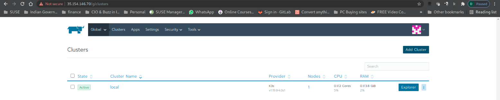
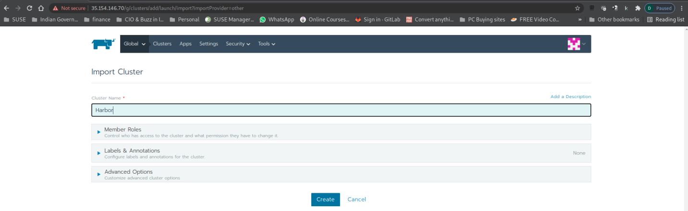
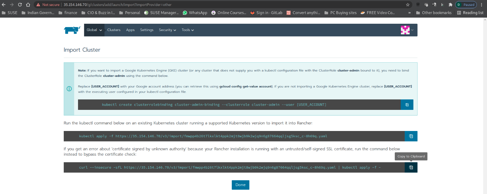
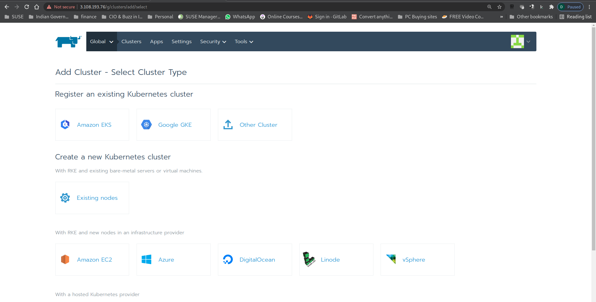
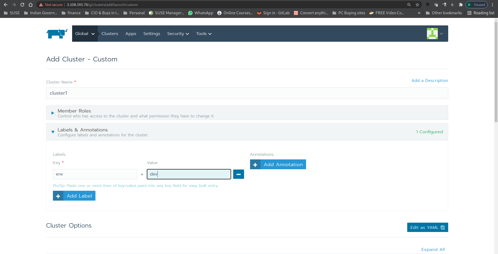
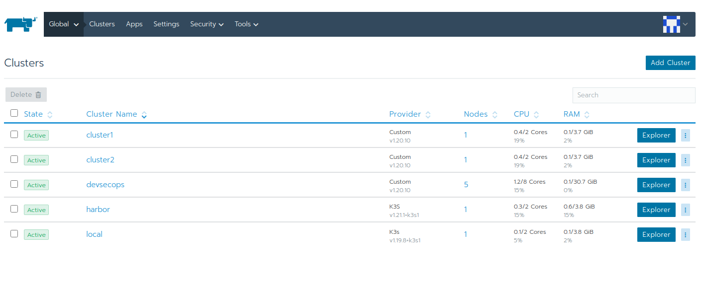
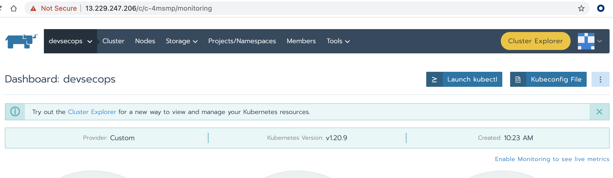

# Part 1 - Build Your Lab Environment on AWS Lightsail

This script will help you setup a lab environment with 8 VMs running on AWS Lightsail.

Estimated Completion Time: 45 mins

* Rancher Management Server v2.5.9 instance (1 VM)
* Harbor private registry running on K3S (1 VM)
* DevSecOps RKE cluster running `Jenkins`, `Anchore`, and `SonarQube` (5 VM - 1 master + 4 worker nodes)
* 2 clusters (1 VM each) for deploying applications.

## Pre-requisites

* Github account
* AWS account with AWS Lightsail full admin access
* Linux workstation with `git` and `aws` command line v2 installed and AWS credential key configured.

## To build the lab on AWS Lightsail

### 1. Clone Git Repository

In your linux terminal, checkout this repository into a local folder. For example,

```
git clone https://github.com/dsohk/rancher-devsecops-workshop workshop
cd workshop
```

To view the content for the Cloned Repo, on your terminal execute below command
``
ll
``
you should see below sample outout. 
```
dpatel@dns:~/devsecops-workshop/workshop> ll
total 36
-rwxr-xr-x 1 dpatel users  903 Sep  1 09:25 cleanlab.sh
drwxr-xr-x 1 dpatel users  120 Sep  2 17:25 docs
-rw-r--r-- 1 dpatel users 1065 Aug 28 22:01 LICENSE
-rw-r--r-- 1 dpatel users  810 Aug 30 11:13 README.md
drwxr-xr-x 1 dpatel users  132 Sep  2 17:25 setup
-rwxr-xr-x 1 dpatel users  995 Sep  1 09:25 setup-rke-cluster1.sh
-rwxr-xr-x 1 dpatel users  995 Sep  1 09:25 setup-rke-cluster2.sh
-rwxr-xr-x 1 dpatel users 1842 Sep  1 09:25 setup-rke-devsecops.sh
-rwxr-xr-x 1 dpatel users 1014 Aug 30 07:52 show-mylab-env.sh
-rwxr-xr-x 1 dpatel users 7826 Aug 31 09:30 startlab.sh
```

### 2. Deploy VMs on AWS Lightsail and Setup Rancher Management Server

Run the `startlab.sh --help` to get list of options. You should see the output like below.

```
❯ ./startlab.sh --help
  ___ _   _ ___ ___   ___              _
 / __| | | / __| __| | _ \__ _ _ _  __| |_  ___ _ _
 \__ \ |_| \__ \ _|  |   / _` | ' \/ _| ' \/ -_) '_|
 |___/\___/|___/___| |_|_\__,_|_||_\__|_||_\___|_|


Welcome to SUSE Rancher DevSecOps Hands-on Lab on AWS Lightsail ...
This script will help you to provision VMs on AWS Lightsail to get started to run your lab exercise. By default, this script will install Rancher for you after VM is up.

usage: ./startlab.sh [options]
-s    | --skip-rancher              Skip deploying Rancher after VM is up.
-h    | --help                      Brings up this menu

```

We will run `startlab.sh` to deploy VMs on AWS Lightsail and automatically setup Rancher management server. It will prompt you which AWS region you would like to run your lab. 

```
./startlab.sh
```

You will be prompted to choose which AWS region you are going to run your lab environment.

```
❯ ./startlab.sh
  ___ _   _ ___ ___   ___              _
 / __| | | / __| __| | _ \__ _ _ _  __| |_  ___ _ _
 \__ \ |_| \__ \ _|  |   / _` | ' \/ _| ' \/ -_) '_|
 |___/\___/|___/___| |_|_\__,_|_||_\__|_||_\___|_|


Welcome to SUSE Rancher DevSecOps Hands-on Lab on AWS Lightsail ...
This script will help you to provision VMs on AWS Lightsail to get started to run your lab exercise. By default, this script will install Rancher for you after VM is up.

usage: ./startlab.sh [options]
-s    | --skip-rancher              Skip deploying Rancher after VM is up.
-h    | --help                      Brings up this menu

Select Your Preferred AWS Environment to run your lab:
1) Tokyo      3) Singapore  5) Mumbai
2) Seoul      4) Sydney	    6) Quit
```

Choose the region closiest to you to continue your lab setup. The script will then
1) Provision VMs on your AWS account with region you picked, 
2) Configure firewall rules of these VMs, 
3) Download AWS SSH keypair to your local folder to access to these VMs, and
4) Create shortcut files for you to access to the VMs in your lab environment.
5) Install Kubernetes tools (`Kubectl` & `helm`)
6) Deploy Rancher using Docker

------------------------------------------------------------
## Incase if you experience Error creating AWS Lighsail instance

Possible error `An error occurred (InvalidInputException) when calling the CreateInstances operation: We're sorry, your AWS account is pending verification. Please try again later`

Resolution - 
Perform cleanup by executing the below script. 
```
./cleanlab.sh
```

----------------------------------------------------------

When the script has finished, you will see a table of VMs with IP addresses, the Rancher instance URL, and other useful files created in your local folder. For example, this is the extract of my output after running the startlab script.

*The IP addresses for you will be different from those in the screenshots in this lab guide.*

```
Your lab environment on AWS Lightsail ap-southeast-2 is ready.

Here's the list of VMs running in your lab environment (See file: mylab_vm_list.txt):
-----------------------------------------------------------------------------
|                               GetInstances                                |
+-----------------------+--------------------+-------------------+----------+
|        VMname         | privateIpAddress   |  publicIpAddress  |  state   |
+-----------------------+--------------------+-------------------+----------+
|  suse0908-devsecops-w1|  172.26.0.133      |  3.25.58.209      |  running |
|  suse0908-cluster1    |  172.26.0.59       |  54.206.211.81    |  running |
|  suse0908-devsecops-m1|  172.26.13.211     |  13.239.1.61      |  running |
|  suse0908-devsecops-w2|  172.26.12.139     |  52.65.89.125     |  running |
|  suse0908-cluster2    |  172.26.5.80       |  3.25.219.16      |  running |
|  suse0908-rancher     |  172.26.12.196     |  3.25.57.210      |  running |
|  suse0908-harbor      |  172.26.6.184      |  3.25.226.182     |  running |
|  suse0908-devsecops-w4|  172.26.1.75       |  13.236.178.85    |  running |
|  suse0908-devsecops-w3|  172.26.14.214     |  54.252.44.198    |  running |
+-----------------------+--------------------+-------------------+----------+

To SSH into the VM on the lab, you can run this command:

./ssh-mylab-<vm>.sh

Your Rancher Instance should be ready in a few minutes ...

Your Rancher URL: https://3.25.57.210

```
Open the Rancher URL in a browser window. This may take few mins

Toggle back to the terminal and execute the below command to see the list of files (text and scripts).

```
ls -lh *mylab*
```
Sample output below.

```
❯ ls -lh *mylab*
-rw-------  1 derekso  staff   835B Aug 26 07:21 mylab-ssh-config
-rw-------  1 derekso  staff   1.6K Aug 26 07:21 mylab.key
-rw-r--r--  1 derekso  staff   381B Aug 26 07:21 mylab.pub
-rw-r--r--  1 derekso  staff    33B Aug 26 07:18 mylab_aws_region.sh
-rw-r--r--  1 derekso  staff   1.2K Aug 26 07:21 mylab_vm_list.txt
-rw-r--r--  1 derekso  staff    26B Aug 26 07:16 mylab_vm_prefix.sh
-rwxr-xr-x  1 derekso  staff    66B Aug 26 07:21 ssh-mylab-cluster1.sh
-rwxr-xr-x  1 derekso  staff    67B Aug 26 07:21 ssh-mylab-cluster2.sh
-rwxr-xr-x  1 derekso  staff    67B Aug 26 07:21 ssh-mylab-devsecops-m1.sh
-rwxr-xr-x  1 derekso  staff    67B Aug 26 07:21 ssh-mylab-devsecops-w1.sh
-rwxr-xr-x  1 derekso  staff    64B Aug 26 07:21 ssh-mylab-devsecops-w2.sh
-rwxr-xr-x  1 derekso  staff    68B Aug 26 07:21 ssh-mylab-devsecops-w3.sh
-rwxr-xr-x  1 derekso  staff    67B Aug 26 07:21 ssh-mylab-devsecops-w4.sh
-rwxr-xr-x  1 derekso  staff    68B Aug 26 07:21 ssh-mylab-harbor.sh
-rwxr-xr-x  1 derekso  staff    69B Aug 26 07:21 ssh-mylab-rancher.sh
```

You can access to any of your VMs with the `ssh-mylab-<VM>.sh` script. The IP addresses of your VMs are also captured in the file `mylab_vm_list.txt`

### 3. Setup Harbor instance and Import into Rancher 

We will be using Harbor as our Private Registry

While we are waiting Rancher Server instance to be ready, let's setup your harbor private registry.

Login to your harbor instance VM with SSH from your linux workstation.

```
./ssh-mylab-harbor.sh
```
Sample output below indicates you are on Harbor VMs Terminal.

```
❯ ./ssh-mylab-harbor.sh
openSUSE Leap 15.2 x86_64 (64-bit)

As "root" use the:
- zypper command for package management
- yast command for configuration management

Have a lot of fun...
suse0908-harbor ec2-user@ip-172-26-2-249:~>
```
On the Harbor VMs Terminal, run the script below to automatically setup harbor private registry on K3S in this VM instance.

```
./99-one-step-install-harbor.sh
```
Sample output below show Harbor URL and Admin User credentials. 

-----------------------------------------------------------
@ Derek, Since we are capturing Harbor URL & credentials in part2, we can remove the below txt
You should see the output of like below. Capture the harbor URL and login credential in your lab worksheet for future use. You can also find this info in a file `myharbor.txt` in your home directory of this harbor VM.
-----------------------------------------------------------
*NOTE* Please do NOT change the harbor login credential as the lab assumes to use the randomly generated strong password throughout the rest of the setup.

```
============================================================
Congrats! Your Harbor instance has been setup successfully.
URL: https://54.153.196.73:30443
User: admin
Password: J4diXo8ZKddi5mFGEgx1Z3XveoOuPw
```
The script has 
1) Deployed K3s cluster.
2) Deploying Harbor (using Helm Chart v1.7.2 & App v2.3.2) on K3s.
3) Configuring Harbor CA cert locally 
4) Downloading Docker Images for Maven, Java Libaries for Maven and Sles15sp3-openjdk and importing them into Harbor 

#### Import Harbor cluster in Rancher.

Incase if your terminal timeout or for any reason you are not on Harbor VMs, please execute the script below which will automtically take you to the Harbor VMs Terminal.
```
./ssh-mylab-harbor.sh
```
Sample output below indicates you are on Harbor VMs Terminal.

```
❯ ./ssh-mylab-harbor.sh
openSUSE Leap 15.2 x86_64 (64-bit)

As "root" use the:
- zypper command for package management
- yast command for configuration management

Have a lot of fun...
suse0908-harbor ec2-user@ip-172-26-2-249:~>
```
Open browser to navigate to the Rancher URL captured in earlier step.

Sample output
```
Your Rancher Instance should be ready in a few minutes ...
Your Rancher URL: https://3.25.57.210
```
By pass the invalid SSL certificate warning, you should be prompted a `Welcome to Rancher` page. Setup your own administrative password, accept the Terms and Conditions, leave the rest of settings as default to continue.


Accept the given IP as your Rancher Server URL to continue.


You will now be navigated to Rancher Cluster Management UI. Click `Add Cluster` button to import a existing cluster with `Register an existing Kubernetes cluster - Other Cluster` method.




Enter the custer name as `Harbor` and leave the rest of the setting as default & click on `Create`. 



You will be prompted with a set of commands. 
Click on clipboard like icon which is the last command which says `certificate signed by unknown authority'. We are choosing self signed options as below.




Paste the command copied from Rancher UI on the Harbor VMs Terminal to start the Import process of Harbor into Rancher

Incase if you see below messages, 
```
error: no objects passed to apply
```
Re-run the command again using the Up arrow key from keyboard.
Sample output below. 


Toggle to Rancher UI and you should find Harbor Cluster is successfully imported!


### 4. Provision DevSecOps RKE cluster from Rancher UI

In the following step, we will add `devsecops` cluster in Rancher.

Navigated to Rancher Cluster Management UI. Click `Add Cluster` button to create a new cluster with `Existing Node` method. 


Enter the cluster name as `devsecops` and leave the rest of the settings as default and click `Next` button. You will be prompted with a command to setup RKE on your VM. Click on clipboard like icon to copy the command into your clipboard.


Open your Linux workstation terminal and switch to the working directory where this repo has been checked out. 

Run the script `./setup-rke-devsecops.sh` and paste the command you copied into the prompt from this script.

```
./setup-rke-devsecops.sh
```

```
❯ ./setup-rke-devsecops.sh
Enter Rancher registration command for devsecops cluster:
```
Sample output below

```
❯ ./setup-rke-devsecops.sh
Enter Rancher registration command for devsecops cluster: 
sudo docker run -d --privileged --restart=unless-stopped --net=host -v /etc/kubernetes:/etc/kubernetes -v /var/run:/var/run  rancher/rancher-agent:v2.5.9 --server https://13.234.238.165 --token 6k7x7px575lwvljxvcvq7rlfn5cqjs4vwmw5lfgkwshrklm56hcph7 --ca-checksum df4eea1dba1880a4f944cb9488db4328c7e374780bfd7578d496de78a3333e9d --worker

Register devsecops-m1 cluster ...
Warning: Permanently added '13.234.186.113' (ECDSA) to the list of known hosts.
aca02b8b2ddcdfce94531c2f0ca6c6dada0935ff1525c6617135429697d075d7

Register devsecops-w1 cluster ...
Warning: Permanently added '3.108.196.228' (ECDSA) to the list of known hosts.
68f7d20dbc09460747d2ff84a315d6fd3aa4d3cc43563e3242b71273ebe7b42f

Register devsecops-w2 cluster ...
Warning: Permanently added '52.66.134.146' (ECDSA) to the list of known hosts.
f292aca663dc23752a17dbc1da37225eca09cd5075b594fa3a7c0fc2037870b3

Register devsecops-w3 cluster ...
Warning: Permanently added '13.126.69.157' (ECDSA) to the list of known hosts.
0d42f90e58ad6fad4ecd75651d241c31ee0b6de8107d3cd7c9e80c837d5de67f

Register devsecops-w4 cluster ...
Warning: Permanently added '65.2.34.12' (ECDSA) to the list of known hosts.
d3915b754e46c5c93ed17f4236c2dd21d04e851157371a71ea72cffc2c3d078a

The devsecops cluster is now being provisioned by Rancher. It may take a few minutes to complete.
Once it's ready, please install Longhorn on it and download KUBECONFIG file into your Harbor VM. Thank you!
```

Return to your browser with Rancher UI, you should see the `devsecops` cluster is being initialized. It may take 5-10 minutes to complete the whole RKE cluster setup.


### 5. Provision additional RKE Clusters (Cluster1 and Cluster2) 

#### All-In-One RKE clusters `Cluster1` 

In the following step, we will add RKE all-in-1 cluster `Cluster1` 

Navigated to Rancher Cluster Management UI. Click `Add Cluster` button to `Create new kubernetes cluster` with RKE and existing bare-metal servers or virtual machine `Existing Node` option. 



Enter the cluster name as `cluster1`, Under `Labels & Annotation` field, add Label with key value pair `env` and `dev`. Leave the rest of the setting as default and click `Next` button. 



Click on clipboard like icon to copy the command and hit `Done`


Run the script `setup-rke-cluster1.sh`. And then paste the command you just copied from Rancher UI to respond to the prompt from this command line.

```
./setup-rke-cluster1.sh
```

#### Provision additional RKE Cluster, All-In-One RKE clusters `Cluster2`

Similar to the cluster1, repeat all step from step5 for adding cluster 2. 

Run the script `setup-rke-cluster2.sh`. And then paste the command you just copied from Rancher UI to respond to the prompt from this command line.

```
./setup-rke-cluster2.sh
```

Finally we should see both clusters `cluster1` and `cluster2` visible in Rancher.



### 6. Download KUBECONFIG file of DevSecOps cluster into Harbor VM



Navigate to `Cluster Manager` in Rancher UI. 

Click `devsecops` cluster name and choose `Cluster` from top menu. 

Click the `Kubeconfig File` button.

Scroll down to the bottom of the popup screen, click `Copy to Clipboard` link to copy the content of this kubeconfig file into your clipboard.

From your Linux workstation, ssh into your harbor VM by executing the script `ssh-mylab-harbor.sh` script). 

```
./ssh-mylab-harbor.sh
```

Create a file `devsecops.cfg` under `~/.kube` folder.

```
vi ~/.kube/devsecops.cfg
```
Paste the kubeconfig content copied from Rancher UI for devsecops cluster into this file, save it and exit.

Configure Kubernetes client to use this kubeconfig file. 

```
export KUBECONFIG=~/.kube/devsecops.cfg
```

Verify if it can connect to your devsecops cluster. If you see an output like below, you are good.

```
kubectl get nodes
```

```
suse0908-harbor ec2-user@ip-172-26-2-249:~>kubectl get node
NAME           STATUS   ROLES               AGE   VERSION
devsecops-m1   Ready    controlplane,etcd   16m   v1.20.9
devsecops-w1   Ready    worker              15m   v1.20.9
devsecops-w2   Ready    worker              14m   v1.20.9
devsecops-w3   Ready    worker              14m   v1.20.9
devsecops-w4   Ready    worker              14m   v1.20.9
```

### 7. Install Longhorn on DevSecOps RKE cluster from Rancher UI

From your Linux workstation, ssh into your harbor VM by executing the script `ssh-mylab-harbor.sh` script). 

```
./ssh-mylab-harbor.sh
```
Type the below command to deploy Longhorn 

```
cd devsecops/longhorn
./99-one-step-install-longhorn.sh
```
You should see below output with successfully deployment of Longhorn

```
Wait while longhorn CSI is still provisioning...
NAME                       READY   UP-TO-DATE   AVAILABLE   AGE
csi-attacher               0/3     3            0           15s
csi-provisioner            1/3     3            1           15s
csi-resizer                0/3     3            0           15s
csi-snapshotter            1/3     3            1           14s
longhorn-driver-deployer   1/1     1            1           52s
longhorn-ui                1/1     1            1           52s

Wait while longhorn CSI is still provisioning...
NAME                       READY   UP-TO-DATE   AVAILABLE   AGE
csi-attacher               3/3     3            3           35s
csi-provisioner            3/3     3            3           35s
csi-resizer                3/3     3            3           35s
csi-snapshotter            3/3     3            3           34s
longhorn-driver-deployer   1/1     1            1           72s
longhorn-ui                1/1     1            1           72s

Your longhorn is ready...

suse0908-harbor ec2-user@ip-172-26-1-70:~/devsecops/longhorn>
```

In Rancher UI, open `devsecops` Cluster Explorer > Longhorn > Overview 


### 8. Deploy Jenkins, Anchore and Sonarqube on devsecops RKE cluster from Harbor VM

We are going to setup these 3 tools on devsecops cluster in parallel. 

Open 3 linux terminal windows, and paste below command to ssh into Harbor VM, as illustrated in the diagram below.

```
./ssh-mylab-harbor.sh
```


In terminal 1 of your Harbor VM, run the following command to setup Jenkins.

```
cd ~/devsecops/jenkins
./99-one-step-install-jenkins.sh
```

This should take awhile to build Jenkins Image along with required plugin of our choice to be build in `devsecops` cluster.

Here a high level view of what been accomplished

1) Deployment & configuration of self signed certificate with Harbor. Self Signed Certificated are distributing to all Labs VMs. With help of Docker Client, we are able to login in the VM using self signed certifiate. 

2) Pulling Jenkins Image, building custom Jenkins image with own choise of plugins for this lab and adding it to Harbor registry.

3) Provisioning Jenkins using Helm Chart (Chart v3.5.15 & App V2.303.1)

4) Configuring Jenkins GitHub webhook

In Terminal 2 of Harbor VM, run the following command to setup Anchore 

```
cd ~/devsecops/anchore
./99-one-step-install-anchore.sh
```
It will also take awhile to deploy anchore on your devsecops cluster. Likewise, let's continue while waiting it to finish.

Likewise in Terminal 3 on Harbor VM, run the following command to setup Sonarqube.

```
cd ~/devsecops/sonarqube
./99-one-step-install-sonarqube.sh
```

You can check the activity of deployment of Jenkins, Anchore & Sonarqube in `devsecops` cluster > `Cluster Explorer` > `Pods` in thier respective namespaces


After few mins we should see all the application and it's container running & ready to serve request.


With this, we are ready to move to the [Step 2 - Configure GitHub and Jenkins](part-2.md)

