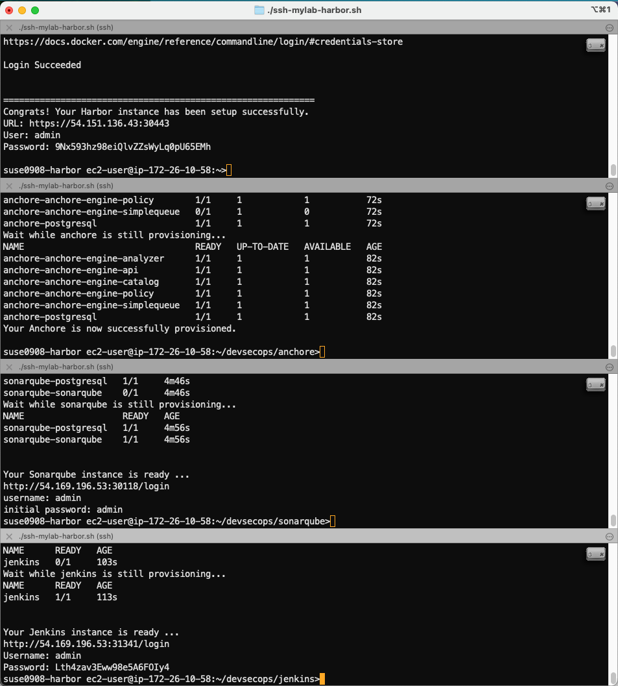

# Part 1 - Build Your Lab Environment on AWS Lightsail

This script will help you setup a lab environment with 8 VMs running on AWS Lightsail.

Estimated Completion Time: 45 mins

* Rancher Management Server v2.5.9 instance (1 VM)
* Harbor private registry running on K3S (1 VM)
* DevSecOps RKE cluster running `Jenkins`, `Anchore`, and `SonarQube` (5 VM - 1 master + 4 worker nodes)
* 2 clusters (1 VM each) for deploying applications.

## Pre-requisites

* Github account
* AWS account with AWS Lightsail full admin access
* Linux workstation with `git` and `aws` command line v2 installed and AWS credential key configured.

## To build the lab on AWS Lightsail

### 1. Check out this repository

In your linux terminal, checkout this repository into a local folder. For example,

```
git clone https://github.com/dsohk/rancher-devsecops-workshop-2021 workshop
cd workshop
```

### 2. Deploy VMs on AWS Lightsail and Setup Rancher Management Server

Run the `startlab.sh --help` to get list of options. You should see the output like below.

```
❯ ./startlab.sh --help
  ___ _   _ ___ ___   ___              _
 / __| | | / __| __| | _ \__ _ _ _  __| |_  ___ _ _
 \__ \ |_| \__ \ _|  |   / _` | ' \/ _| ' \/ -_) '_|
 |___/\___/|___/___| |_|_\__,_|_||_\__|_||_\___|_|


Welcome to SUSE Rancher DevSecOps Hands-on Lab on AWS Lightsail ...
This script will help you to provision VMs on AWS Lightsail to get started to run your lab exercise.

usage: ./startlab.sh [options]
-a    | --auto-deploy-rancher       Specify this flag to auto-deploy Rancher after the lab on AWS is up.
-h    | --help                      Brings up this menu
```

We will run `startlab.sh -a` to deploy VMs on AWS Lightsail and automatically setup Rancher management server. It will prompt you which AWS region you would like to run your lab. 

```
./startlab.sh -a
```

You will be prompted to choose which AWS region you are going to run your lab environment.

```
❯ ./startlab.sh -a
  ___ _   _ ___ ___   ___              _
 / __| | | / __| __| | _ \__ _ _ _  __| |_  ___ _ _
 \__ \ |_| \__ \ _|  |   / _` | ' \/ _| ' \/ -_) '_|
 |___/\___/|___/___| |_|_\__,_|_||_\__|_||_\___|_|


Welcome to SUSE Rancher DevSecOps Hands-on Lab on AWS Lightsail ...
This script will help you to provision VMs on AWS Lightsail to get started to run your lab exercise.

NOTE: You have opted-in to deploy Rancher after your VM on AWS is up.

Select Your Preferred AWS Environment to run your lab:
1) Tokyo      3) Singapore  5) Mumbai
2) Seoul      4) Sydney	    6) Quit
```

Choose the region closiest to you to continue the lab setup. The script will then
1) provision VMs on your AWS account with region you picked, 
2) configure firewall rules of these VMs, 
3) download AWS SSH keypair to your local folder to access to these VMs,
4) setup shortcut files for you to access to the lab environment.

When the script has finished, you will see a table of VMs with IP addresses, the Rancher instance URL, and other useful files created in your local folder. For example, this is the extract of my output after running the startlab script. Obviously, the IP addresses listed will be different from yours.

```
---------------------------------------------------------
Please wait for 5-10 mins to initializing Rancher server.

Your Rancher Server URL: https://13.211.212.252

Your lab environment on AWS Lightsail ap-southeast-2 is ready.

Here's the list of VMs running in your lab environment (See file: mylab_vm_list.txt):
-----------------------------------------------------------------------------
|                               GetInstances                                |
+-----------------------+--------------------+-------------------+----------+
|        VMname         | privateIpAddress   |  publicIpAddress  |  state   |
+-----------------------+--------------------+-------------------+----------+
|  suse0908-devsecops-w4|  172.26.7.1        |  3.106.59.234     |  running |
|  suse0908-cluster1    |  172.26.5.29       |  52.63.55.97      |  running |
|  suse0908-devsecops-w1|  172.26.9.38       |  3.25.197.232     |  running |
|  suse0908-rancher     |  172.26.13.230     |  13.211.212.252   |  running |
|  suse0908-devsecops-w3|  172.26.15.250     |  3.106.113.195    |  running |
|  suse0908-devsecops-m1|  172.26.15.105     |  52.62.113.31     |  running |
|  suse0908-harbor      |  172.26.2.249      |  54.153.196.73    |  running |
|  suse0908-cluster2    |  172.26.8.163      |  52.64.52.130     |  running |
|  suse0908-devsecops-w2|  172.26.4.218      |  3.25.72.2        |  running |
+-----------------------+--------------------+-------------------+----------+

To SSH into the VM on the lab, you can run this command:

./ssh-mylab-<vm>.sh

Please continue the lab exercises according to our guide. Thank you! Have a nice day!
```

When you run `ls -l` command, you should see a list of shortcut files created for you as well.

```
❯ ls -lh *mylab*
-rw-------  1 derekso  staff   835B Aug 26 07:21 mylab-ssh-config
-rw-------  1 derekso  staff   1.6K Aug 26 07:21 mylab.key
-rw-r--r--  1 derekso  staff   381B Aug 26 07:21 mylab.pub
-rw-r--r--  1 derekso  staff    33B Aug 26 07:18 mylab_aws_region.sh
-rw-r--r--  1 derekso  staff   1.2K Aug 26 07:21 mylab_vm_list.txt
-rw-r--r--  1 derekso  staff    26B Aug 26 07:16 mylab_vm_prefix.sh
-rwxr-xr-x  1 derekso  staff    66B Aug 26 07:21 ssh-mylab-cluster1.sh
-rwxr-xr-x  1 derekso  staff    67B Aug 26 07:21 ssh-mylab-cluster2.sh
-rwxr-xr-x  1 derekso  staff    67B Aug 26 07:21 ssh-mylab-devsecops-m1.sh
-rwxr-xr-x  1 derekso  staff    67B Aug 26 07:21 ssh-mylab-devsecops-w1.sh
-rwxr-xr-x  1 derekso  staff    64B Aug 26 07:21 ssh-mylab-devsecops-w2.sh
-rwxr-xr-x  1 derekso  staff    68B Aug 26 07:21 ssh-mylab-devsecops-w3.sh
-rwxr-xr-x  1 derekso  staff    67B Aug 26 07:21 ssh-mylab-devsecops-w4.sh
-rwxr-xr-x  1 derekso  staff    68B Aug 26 07:21 ssh-mylab-harbor.sh
-rwxr-xr-x  1 derekso  staff    69B Aug 26 07:21 ssh-mylab-rancher.sh
```

You can access to any of your VMs with the `ssh-mylab-<VM>.sh` script. The IP addresses of your VMs are also captured in the file `mylab_vm_list.txt`.


### 3. Setup your harbor instance

While we are waiting Rancher Server instance to be ready, let's setup your harbor private registry.

Login to your harbor instance VM with SSH from your linux workstation.

```
./ssh-mylab-harbor.sh
```

You should see the prompt like below. The prompt should be indicated the VM name you are currently working on.

```
❯ ./ssh-mylab-harbor.sh
openSUSE Leap 15.2 x86_64 (64-bit)

As "root" use the:
- zypper command for package management
- yast command for configuration management

Have a lot of fun...
/usr/bin/manpath: can't set the locale; make sure $LC_* and $LANG are correct
suse0908-harbor ec2-user@ip-172-26-2-249:~>
```

In the prompt above, run the script below to automatically setup harbor private registry on K3S in this VM instance.

```
./99-one-step-install-harbor.sh
```

You should see the output of like below. Capture the harbor URL and login credential in your lab worksheet for future use. You can also find this info in a file `myharbor.txt` in your home directory of this harbor VM.

*NOTE* Please do NOT change the harbor login credential as the lab assumes to use the randomly generated strong password throughout the rest of the setup.

```
...
Login to harbor with docker client ...
WARNING! Using --password via the CLI is insecure. Use --password-stdin.
WARNING! Your password will be stored unencrypted in /root/.docker/config.json.
Configure a credential helper to remove this warning. See
https://docs.docker.com/engine/reference/commandline/login/#credentials-store

Login Succeeded


============================================================
Congrats! Your Harbor instance has been setup successfully.
URL: https://54.153.196.73:30443
User: admin
Password: J4diXo8ZKddi5mFGEgx1Z3XveoOuPw
```

### 4. Provision DevSecOps RKE cluster from Rancher UI

Open browser to navigate to the Rancher URL captured in earlier step. By pass the invalid SSL certificate warning, you should be prompted a `Welcome to Rancher` page. Setup your own administrative password, accept the Terms and Conditions, leave the rest of settings as default to continue.


Accept the given IP as your Rancher Server URL to continue.


You will now be navigated to Rancher Cluster Management UI. Click `Add Cluster` button to create a new cluster with `Existing Node` method. 


Enter the cluster name as `devsecops` and leave the rest of the settings as default and click `Next` button. You will be prompted with a command to setup RKE on your VM. Click the `copy` icon to copy the command into your clipboard.


Open your Linux workstation terminal and switch to the working directory where this repo has been checked out. 

Run the script `./setup-rke-devsecops.sh` and paste the command you copied into the prompt from this script.

```
❯ ./setup-rke-devsecops.sh
Enter Rancher registration command for devsecops cluster:
```

The output will be like below. This script will help you to configure the given command to execute the command remotely via ssh in all member VMs of your devsecops cluster. This can take a few minutes but it saves us from potential copy-and-paste human error throughout the setup process.

```
❯ ./setup-rke-devsecops.sh
Enter Rancher registration command for devsecops cluster:
sudo docker run -d --privileged --restart=unless-stopped --net=host -v /etc/kubernetes:/etc/kubernetes -v /var/run:/var/run  rancher/rancher-agent:v2.5.9 --server https://13.211.212.252 --token tszcbp4j2qkx872j8vt9c6x57p5spv2fl7h5v7fsx8dghbc7jmpsh7 --ca-checksum 8e5121527a343c673c9c6660602c7f95fdd28d6ccc3c247d5cc3e437c8d1feec --worker

Register devsecops-m1 cluster ...
Warning: Permanently added '52.62.113.31' (ECDSA) to the list of known hosts.
Unable to find image 'rancher/rancher-agent:v2.5.9' locally
v2.5.9: Pulling from rancher/rancher-agent
e7ae86ffe2df: Pulling fs layer
..........
..........
428cad6e906b: Pull complete
Digest: sha256:fee10940c61c36055120ca9ef624810a740647cff4751d0b21266939c9da4b93
Status: Downloaded newer image for rancher/rancher-agent:v2.5.9
3fcdbe011deba7ddcd147e84660db91e37efd0df6a00c17099fd863982b8c118
```

Return to your browser with Rancher UI, you should see the `devsecops` cluster is being initialized. It may take 5-10 minutes to complete the whole RKE cluster.


### 5. Install Longhorn on DevSecOps RKE cluster from Rancher UI

Navigate to `Cluster Explorer` of `devsecops` cluster from Rancher UI. 


Choose `Apps & Marketplace` from its top left pulldown menu.


Click `Longhorn` apps from the catalog.

When prompted the `Install Longhorn` page, leave all the settings as default and click `Install` button to continue. It should take 1-2 minutes to complete the longhorn deployment.  The Longhorn item should appear under the top left pulldown menu.

### 6. Download KUBECONFIG file of DevSecOps cluster to Harbor VM

Navigate to `Cluster Manager` in Rancher UI. 

Click `devsecops` cluster name and choose `Cluster` from top menu. 

Click the `Kubeconfig File` button.

Scroll down to the bottom of the popup screen, click `Copy to Clipboard` link to copy the content of this kubeconfig file into your clipboard.

From your Linux workstation, ssh into your harbor VM (using `ssh-mylab-harbor.sh` script). 

Create a file `devsecops.cfg` under `~/.kube` folder.

```
vi ~/.kube/devsecops.cfg
```

Paste the kubeconfig content copied from Rancher UI for devsecops cluster into this file, save it and exit.

Configure Kubernetes client to use this kubeconfig file. 

```
export KUBECONFIG=~/.kube/devsecops.cfg
```

Verify if it can connect to your devsecops cluster. If you see an output like below, you are good.

```
suse0908-harbor ec2-user@ip-172-26-2-249:~>kubectl get node
NAME           STATUS   ROLES               AGE   VERSION
devsecops-m1   Ready    controlplane,etcd   16m   v1.20.9
devsecops-w1   Ready    worker              15m   v1.20.9
devsecops-w2   Ready    worker              14m   v1.20.9
devsecops-w3   Ready    worker              14m   v1.20.9
devsecops-w4   Ready    worker              14m   v1.20.9
```

### 7. Deploy Jenkins, Anchore and Sonarqube on devsecops RKE cluster from Harbor VM

We are going to setup these 3 tools on devsecops cluster in parallel. 

Open 3 linux terminal windows, ssh into Harbor VM, as illustrated in the diagram below.



In terminal 1 of your Harbor VM, run the following command to setup Jenkins.

```
cd ~/devsecops/jenkins
./99-one-step-install-jenkins.sh
```

It should take awhile to build custom Jenkins images with our own choice of plugins for this lab, upload to your harbor private registry, and deploy Jenkins with helm chart onto your `devsecops` cluster.

While we are waiting, run the following command to setup Anchore in terminal 2 of your Harbor VM.

```
cd ~/devsecops/anchore
./99-one-step-install-anchore.sh
```

It will also take awhile to deploy anchore on your devsecops cluster. Likewise, let's continue while waiting it to finish.

Run the following command to setup Sonarqube in terminal 3 of your Harbor VM.

```
cd ~/devsecops/sonarqube
./99-one-step-install-sonarqube.sh
```

Once all the above scripts finished, you can retrieve the login credentials or URL for Jenkins and Sonarqube. Details are stored in the home directory of your harbor VM. For example, 

```
suse0908-harbor ec2-user@ip-172-26-2-249:~>ls -l ~/my*.*
-rw-r--r-- 1 ec2-user users  111 Aug 25 23:41 /home/ec2-user/myharbor.sh
-rw-r--r-- 1 ec2-user users  116 Aug 26 00:34 /home/ec2-user/myjenkins.txt
-rw-r--r-- 1 ec2-user users 1203 Aug 25 23:21 /home/ec2-user/mylab_vm_list.txt
-rw-r--r-- 1 ec2-user users  109 Aug 26 00:36 /home/ec2-user/mysonarqube.txt
```

Congratulations!  With this, we are ready to follow the lab instructure to configure Jenkins and setup our first pipeline.


## Clean Up the Lab

Once you have finished your lab, you can run the script below from the folder of your linux workstation where this repository has been checked out. 

```
❯ ./cleanlab.sh
  ___ _   _ ___ ___   ___              _
 / __| | | / __| __| | _ \__ _ _ _  __| |_  ___ _ _
 \__ \ |_| \__ \ _|  |   / _` | ' \/ _| ' \/ -_) '_|
 |___/\___/|___/___| |_|_\__,_|_||_\__|_||_\___|_|


Welcome to SUSE Rancher DevSecOps Hands-on Lab on AWS Lightsail ...

This script will clean up all the VMs provisioned in your AWS Lightsail environment.
Continue (y/n)?
```

Hit `y` key to continue. The script will decommission all the VMs created for this lab from your AWS account. 


# Feedback

If you have any comments, suggestions or feedback to help improving this workshop, please feel free to reach out to our Team.

