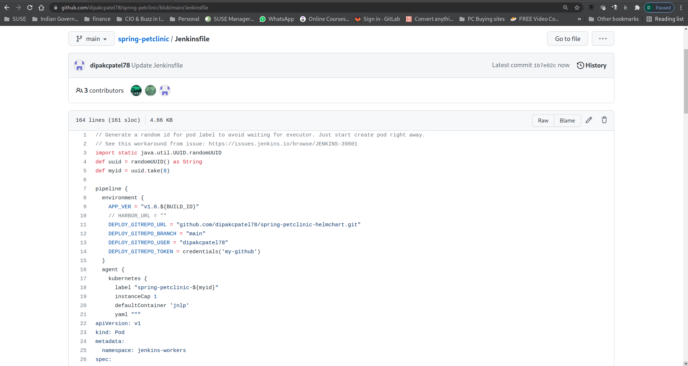
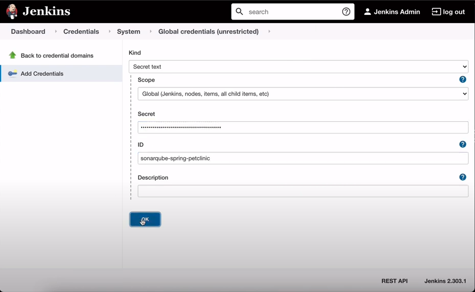

# Part 2 - Configure GitHub & Jenkins 

Watch a video to explain what we are going to do in part 2:

[](https://www.youtube.com/watch?v=sAxLXaw2UAU)


Before we begin to configure Github & Jenkins, let's look at our lab environment. 

Ensure you are on your local workstation/machine Terminal where we have our git repo cloned.

Sample output below.
```
dpatel@dns:~/devsecops-workshop/workshop>
```
Run the command below to show your current lab environment. This shows you all information you need to configure your Jenkins in this section.

```
./show-mylab-env.sh
```

Sample output below.

```
Your Rancher Server URL: https://52.221.224.193

My Harbor Instance ...
URL: https://18.138.241.59:30443
User: admin
Password: V4P6Z8NA3yXpEjrpIjPl9O05ITnXhM

Your Jenkins instance is ready ...
http://13.251.59.142:31409/login
Username: admin
Password: DIY1aHNzqfn3Hk79L7UeQ8

Your Jenkins Github webhook Payload URL:
http://13.251.59.142:31409/github-webhook/

Your Anchore is now successfully provisioned.
URL: http://anchore-anchore-engine-api.anchore.svc.cluster.local:8228/v1/
User: admin
Password: ZuhWUXq0BvKfnCgHP4eqIIIVVR6oKzko

Your Sonarqube instance is ready ...
http://13.251.59.142:30612/login
username: admin
initial password: admin


My Github personal access token:

My SonarQube token:

```

A file `mylab_env.txt` should also have created for you. 

Use text editor to open this file and get ready to record down your further tokens to be collected in this part.

## 1 - Fork the Spring-Petclinic Project into your own Github Account

Open a new Browser & past the below link

```
https://github.com/dsohk/spring-petclinic
```

Click on `Fork` Icon on top right hand window pane & select your own account name. 

Sample Output below.


### Adapt Jenkinsfile for workshop

In GitHub, navigate to your forked repoistory `Spring-Petclinic`. 

The only change to our Jenkins file to adapt to our worksop requirement is the change in line 11.

In line 11, replace `your_name` with `your github account name`

Sample Output for reference.


Once the changes are made, scroll down to the bottom of the page & hit `Commit changes` 


Review our changes and see if it's applied successfully.
 



## 2 - Fork the Spring-Petclinic-Helmchart Project into your own Github Account

Open a new Browser & past the below link

```
https://github.com/dsohk/spring-petclinic-helmchart
```
Click on Fork Icon on top right hand window pane & select your own account where the repo will be forked.

Edit the `spring-petclinic-helmchart/values.yaml` file. 

Look for line 
```
image:
  repository: harbor.example.com/library/samples/spring-petclinic
```
You need to change the image URL to point to your Harbor Instance.Note only pick up the IP & port (leave http/https:). 
```
image:
  repository: 3.108.252.247:30443/library/samples/spring-petclinic
```
Commit the changes to the repo. 

Sample output below. 


Once these repository are forked, they become available to us locally in our account. Let verify if we can see them. Sample output below.


## 3 - Configure Github with Personal Access Token & Webook

### 1. Generate Personal Access Token

In order to integrate Jenkins with your github account, we have to generate your personal access token for this.

1. Login to your github account
2. Under your avatar icon, pull down the menu and choose `Settings` menu item.
3. Choose `Developer Settings` menu on the left, choose `Personal Access Tokens`
4. Click `Generate new token` button.
5. Enter `workshop` (or whatever you like) in the name field.
6. Choose `repo` and `user:email` in the privieged for this token.


7. Save and record down the generated token in the `mylab_env.txt` file for configuring CI Pipeline in Jenkins later.

### 2. Create WebHook for forked repository `

Setup git webhook for spring-petclinic repo to your Jenkins server

1. Click `Settings` in your spring-petclinic github repo.
2. Choose `Webhooks` from the left menu.
3. Click `Add Webhook` button
4. Enter Your Jenkins Github webhook Payload URL:
http://<YOUR_JENKINS_IPADDRESS>:<YOUR_JENKINS_PORT>/github-webhook/
5. Choose `Send me everything` for events to trigger this webhook.
6. Click `Add Webhook` button.


## 4 - Generate Sonarqube Token

1. Login to your Sonarqube instance using the Sonarqube URL & Credentials. Upon successful login, you will be prompt to change your initial password. 
2. Choose `Add a Project`. 


3. Select `Manually` to continue
3. Enter `spring-petclinic` in Project Key and Display Name input field and hit `Set up`
4. In the Provide a token input field, enter `spring-petclinic` and click `Generate Token` button.
5. Record the generate token in your `mylab_env.txt` file for configuring Jenkins later.

At this point, we are done with Sonarqube setting. You can logout from Sonarqube or close the browser window to exit.

## 5 - Configure Jenkins 

Configuring Jenkins will be in two sections
1 - Configure Credential for GitHub and Sonarqube
2 - Configure Jenkins Systems for global environment varaiables.

### a. Configure Jenkins - GitHub Credentials. 

Open Jenkins URL on your browser. 

1. Login to Jenkins
2. Choose `Manage Jenkins` on the left menu
3. Under `Security` Section, Choose `Manage Credentials`
4. Under `Stores scoped to Jenkins`, click the `(global)` dropdown menu. Choose `Add credentials`.
5. In the `Add Credentials` form, choose `Secret text` in `Kind` field.
6. Enter your Github's personal access token in the `Secret` field.  Token is stored in the `mylab_env.txt`
7. Enter `my-github` in the `ID` field. Please MAKE SURE this is correct as to match the value in our Jenkins Pipeline.
8. Click `OK` button to continue

Sample Screenshot below.


### b. Configure Jenkins - Sonarqube Credentials 

1. Click Add Credentials on Left Hand side of the Page. 
2. In the `Add Credentials` form, choose `Secret text` in `Kind` field.
3. Enter your Sonarqube token in the `Secret` field. Token is stored in the `mylab_env.txt`
4. Enter `sonarqube-spring-petclinic` in the `ID` field. 
5. Click `OK` button to continue

Sample Screenshot below


We are done with the credential for Github and Sonarqube. 

Now navigate back to the Jenkins Dashboard.

### Configure Jenkins System with Global Environmental Varaiables. 

Navigate to `Managing Jenkins` > `Configure System`
Scroll down to `Global Properties` section.

1. Select `Environment Variables` checkbox
2. Under List of Variables, click `Add` button to continue.
3. Under NAME, key in 
   * Key: `HARBOR_URL`
   * Value: (Your Harbor_URL) (just IP:PORT - no http:// or https://)

Sample screenshot below


#### Sonarqube

Enable `Environment variables` checkbox

In the `Sonarqube installations` click on `Add SonarQube`
section, enter the following.

* Name: `My SonarQube` Note name must spelled excatly as mentioned here.
* Server URL: (Your SonarQube URL)

Under `Server authentication token` use the drop down option and you should see `sonarqube-spring-petclinic`. Select it. 


#### Git plugin

Specify the github username and email account in this section. It can be any arbitrary account. It will be showing up the commits to your forked helm chart repository later.

1. Global Config user.name : jenkins
2. Global Config user.email: jenkins@example.com

#### Anchore Container Image Scanner

1. Engine URL: (Your Anchore URL)
2. Engine Username: (Your Anchore username)
3. Engine Password: Click on `change Password` and replace with your Anchore password)
4. Engline Password: 
Click `Save` button to save the Jenkins configuration settings.

With this, we are ready to move to the [Step 3 - Build Your Jenkins Pipelines to deploy Spring-Petclinic App](part-3.md)


