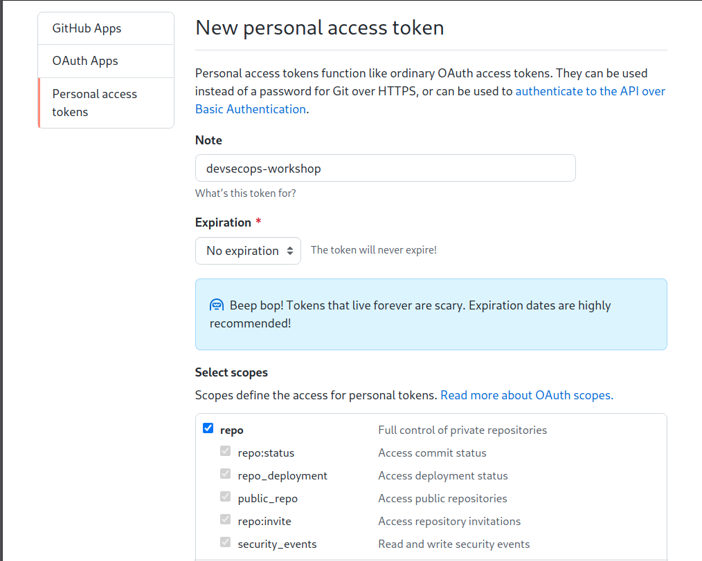
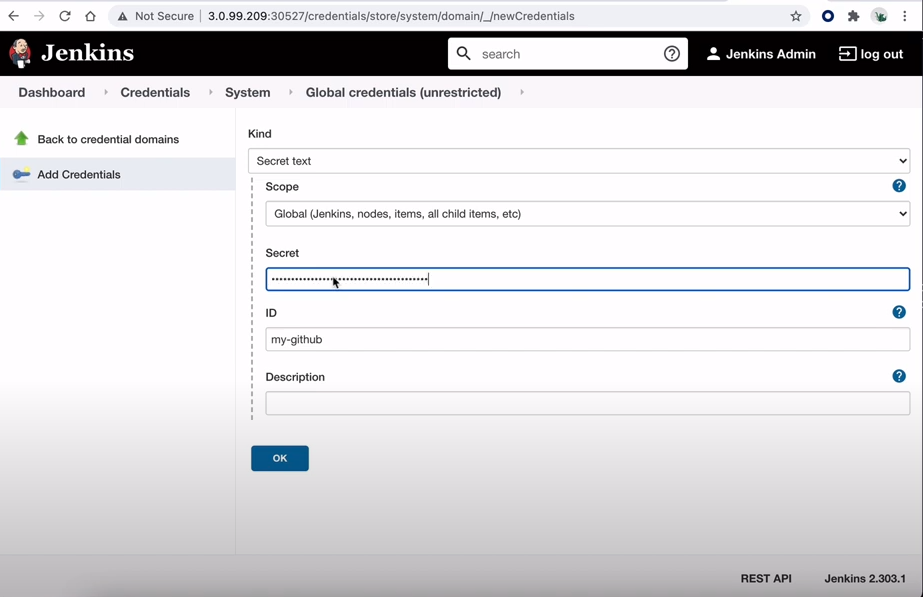
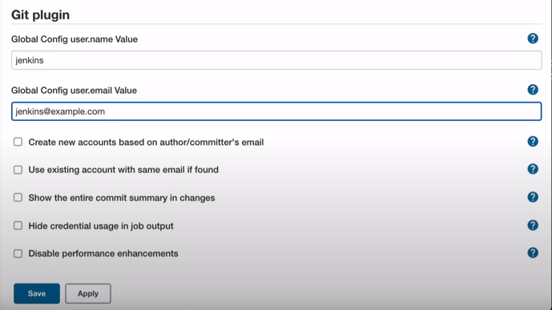
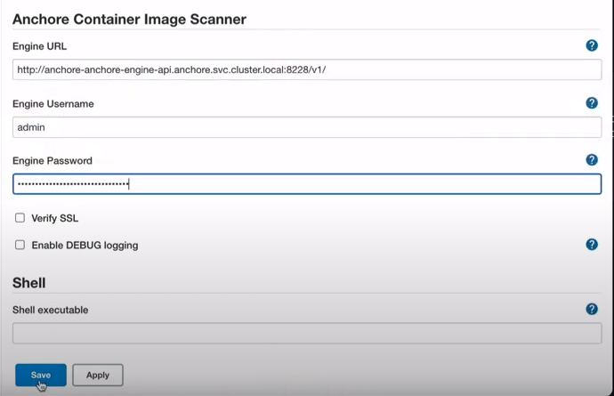

# Part 2 - Configure GitHub & Jenkins 

Watch a video to explain what we are going to do in part 2:

[](https://www.youtube.com/watch?v=sAxLXaw2UAU)

## 1. View lab enviroment.

Before we begin to configure Github & Jenkins, let's look at our lab environment.

NOTE: Make sure Jenkins, Anchore, and Sonarqube installation has been completed as per final step of Part 1.

1) Ensure you are on your local workstation/machine Terminal where we have our git repo cloned.

2) Run the command below to show your current lab environment. This shows you all information you need to configure your Jenkins in this section.

```
./show-mylab-env.sh
```

Sample output below.

```
Your Rancher Server URL: https://rancher.13.232.154.67.sslip.io
Bootstrap Password: 4rfkljvwb6ldbplfgfjg6tppwggbsq56mgl9npntltn4qpc6dhv9nf

My Harbor Instance ...
URL: https://65.0.177.135:30443
User: admin
Password: pRRIDUb0R8peM81cEQ3UAkMwm16BaB

Your Jenkins instance is ready ...
http://3.109.200.216:31897/login
Username: admin
Password: JiKNwNpB840adU19HeAzZW

Your Jenkins Github webhook Payload URL:
http://3.109.200.216:31897/github-webhook/

Your Anchore is now successfully provisioned.
URL: http://anchore-anchore-engine-api.anchore.svc.cluster.local:8228/v1/
User: admin
Password: zgWwwAtvyWSUaZ3OhrEqzvkh8mh0NdY7

Your Sonarqube instance is ready ...
http://3.109.200.216:32143/login
username: admin
initial password: admin

My Github personal access token: 

My SonarQube token: 
```

A file `mylab_env.txt` should also have created for you. 

3) Use text editor to open this file to record GitHub and SonarQube tokens.

## 2- Fork the Spring-Petclinic Project into your own Github Account

1) Open a new Browser & past the below link

```
https://github.com/dsohk/spring-petclinic
```

2) Click on `Fork` Icon on top right hand window pane & select your own account name. 

Sample Output below.


### Adapt Jenkinsfile for workshop

1) In GitHub, navigate to your forked repoistory `Spring-Petclinic`. 

2) Edit the Jenkinsfile

The only change to our Jenkins file is in `Line 11` to adapt to our worksop requirement.

In line 11, replace `your_name` with `your github account name`

Sample Output for reference.


Once the changes are made, scroll down to the bottom of the page & hit `Commit changes` 


3) Review your changes and see if it's applied successfully.
 


## 2 - Fork the Spring-Petclinic-Helmchart Project into your own Github Account

1) Open a new Browser & paste the below link

```
https://github.com/dsohk/spring-petclinic-helmchart
```
2) Click on Fork Icon on top right hand window pane & select your own account where the repo will be forked.

## 3 - Configure Github with Personal Access Token & Webook

### 1) Generate Personal Access Token

In order to integrate Jenkins with your github account, you have to generate your personal access token for this.

a) Login to your github account

b) Under your avatar icon, pull down the menu and choose `Settings` menu item.

c) Choose `Developer Settings` menu on the left, choose `Personal Access Tokens`

d) Click `Generate new token` button.

e) Enter `workshop` (or whatever you like) in the name field.

f) Choose `repo` and `user:email` in the privieged for this token.




g) Save and record down the generated token in the `mylab_env.txt` file for configuring CI Pipeline in Jenkins later.

### 2). Create WebHook for forked repository `

Setup git webhook for **spring-petclinic** repo to your Jenkins server

a) Click `Settings` in your **spring-petclinic** github repo.

b) Choose `Webhooks` from the left menu.

c) Click `Add Webhook` button

d) Enter Your Jenkins Github webhook Payload URL:
http://<YOUR_JENKINS_IPADDRESS>:<YOUR_JENKINS_PORT>/github-webhook/ 

e) Choose `Send me everything` for events to trigger this webhook.

f) Click `Add Webhook` button.


## 4 - Generate Sonarqube Token

1) Login to your Sonarqube instance using the Sonarqube URL & Credentials. Upon successful login, you will be prompted to change your initial password.

2) Choose `Add a Project`. 


3) Select `Manually` to continue

4) Enter `spring-petclinic` in Project Key and Display Name input field and hit `Set up`

5) In the Provide a token input field, enter `spring-petclinic` and click `Generate Token` button.

6) Record the generated token in your `mylab_env.txt` file for configuring Jenkins later.

At this point, we are done with Sonarqube setting. You can logout from Sonarqube or close the browser window to exit.

## 5 - Configure Jenkins 

Configuring Jenkins will be in two parts

1) Configure Credential for GitHub and Sonarqube

2) Configure Jenkins Systems for global environment varaiables.

### 1) Configure Jenkins - GitHub Credentials. 

a) Open Jenkins URL in your browser and login.

b) Choose `Manage Jenkins` on the left menu. You may see a message `It appears that your reverse proxy setup is broken` ignore the message. 

c) Under `Security` Section, Choose `Manage Credentials`

d) Under `Stores scoped to Jenkins`, click the `(global)` dropdown menu. Choose `Add credentials`.

e) In the `Add Credentials` form, choose `Secret text` in `Kind` field.

f) Enter your Github's personal access token in the `Secret` field.  Token is available in the `mylab_env.txt`

g) Enter `my-github` in the `ID` field. 

**IMPORTANT - If you change the name your jenkins pipeline will break. Also please ensure there is no whitespace before and after the ID.**.

h) Click `OK` button to continue

Sample Screenshot below.


### 2) Configure Jenkins - Sonarqube Credentials 

a) Again click `Add Credentials` on Left Hand side of the Page. 

b) In the `Add Credentials` form, choose `Secret text` in `Kind` field.Token is available in the `mylab_env.txt`

c) Enter `sonarqube-spring-petclinic` in the `ID` field. 

d) Click `OK` button to continue

Sample Screenshot below


We are done with the credential for Github and Sonarqube. 

Now navigate back to the Jenkins Dashboard.

### Configure Jenkins System with Global Environmental Varaiables. 

1) Navigate to `Managing Jenkins` > `Configure System`

2) Scroll down to `Global Properties` section.

a) Select `Environment Variables` checkbox

b) Under List of Variables, click `Add` button to continue.

c) Under NAME, key in 
   * Key: `HARBOR_URL`
   * Value: `IP:Port` **(This should be your Harbor IP and Port Number. No whitespaces before and after. Also No http:// or https://)**

Sample screenshot below


#### Sonarqube

1) Scroll down to Section `SonarQube Servers`

2) Select `Environment variables` checkbox 

3) Under `Sonarqube installations` click on `Add SonarQube`
section, enter the following.

a) Name: `My SonarQube` **Please note that Name must be spelled excatly as mentioned here. No whitespaces before and after the ID**

b)`Server URL`: (Your SonarQube URL)

c) Under `Server authentication token` use the drop down option and you should see `sonarqube-spring-petclinic`. Select it. 

Sample Screenshot below


#### Git plugin

1) Scroll down to Git Plugin Section.

2) Specify the github username and email account in this section. It can be any arbitrary account. It will be showing up the commits to your forked helm chart repository later.

a) Global Config user.name : jenkins

b) Global Config user.email: jenkins@example.com

c) Leave the rest as default

Sample Screenshot below.




#### Anchore Container Image Scanner

1) Scroll further down to Achore Container Image Scanner Section.

2) Provide Anchore URL & Credentials. 

a) Engine URL: (Your Anchore URL)

b) Engine Username: (Your Anchore username)

c) Engine Password: (Your Anchore password)



Finally click `Save` button to save all the Jenkins configuration settings.

With this, we are ready to move to the [Step 3 - Build Your Jenkins Pipelines to deploy Spring-Petclinic App](part-3.md)


