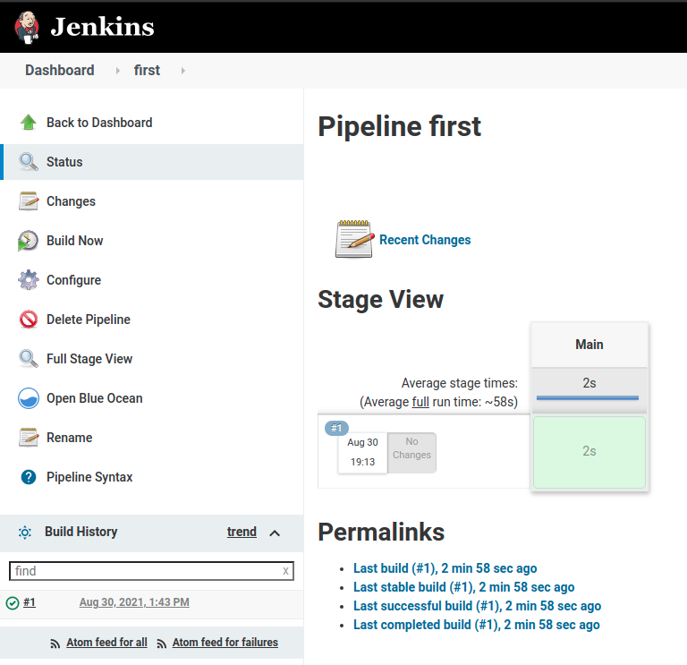
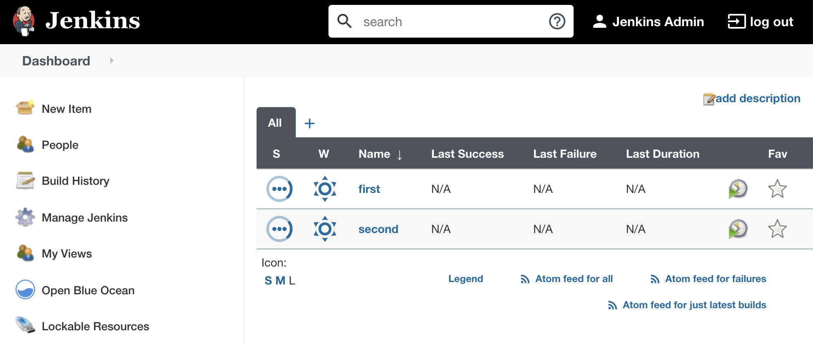

# Part 2 - My First Jenkins Pipeline

With Jenkins, Sonarqube, Anchore running on the Rancher-managed devsecops cluster, let's build our very first Jenkins pipeline.

Run the command below to show your current lab environment. This shows you all information you need to configure your Jenkins in this section.

```
./show-mylab-env.sh
```

## Build my first Jenkins Pipeline

1. Login to Jenkins with the URL and credentials generated from Part 1.
2. Click `Create Job`


3. Enter a name `first`
4. Choose `Pipeline` and click OK.


5. Jenkins will navigate to the Configure Pipeline page, navigate to Pipeline section


6. Choose `try sample Pipeline` pulldown menu.
7. Choose `Declarative (Kubernetes)`


8. Click `Save` button
9. On the left menu, click `Build Now` to trigger the first jenkins pipeline.

Click on Status inside the job to view job status.



In Rancher UI, toggle to `devsecops` cluster. Click on `Cluster Explorer` & in `Pods` section you can see the progress of Jenkins jobs. Below images illustrates the Jenkins pipeline has successfully create the pods & later you can see it getting terminated once the job is completed successfully


## Build my second Jenkins Pipeline

Like the first pipeline, create the `second` pipeline but this time choose `Maven (Kubernetes)` from `try sample Pipeline` pulldown menu.

Click `Build Now` to trigger the second Jenkins pipeline.

You should now have 2 pipelines created in Jenkins which will create Kubernetes pods on Rancher-managed cluster to run each job. 



## Examine Cluster Explorer in Rancher

Now, let's examine in the pods in Rancher. You will notice the pods will be created on demand everytime when the Pipeline runs and got terminated once it's finished.

Rancher UI select DevSecOps Cluster & click explorer 

In the left hand navigation plane select Pods

Select Jenkins Namespace from dropdown. 

In the Pod Plane you should see Jenkins and your pipeline pods been created & then once the job is over getting teminated 

Image below will illustrate the same.


With the Jenkins being verified to work well with Rancher-managed Kubernetes, let's move on to 
[Step 3 - Build CI Pipeline for spring-petclinic](part-3.md).

