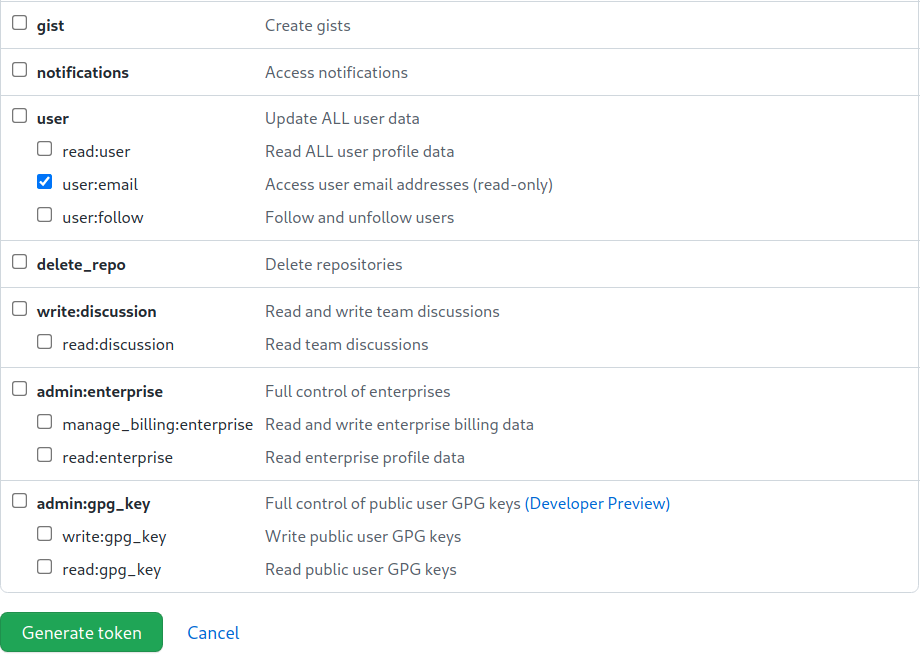
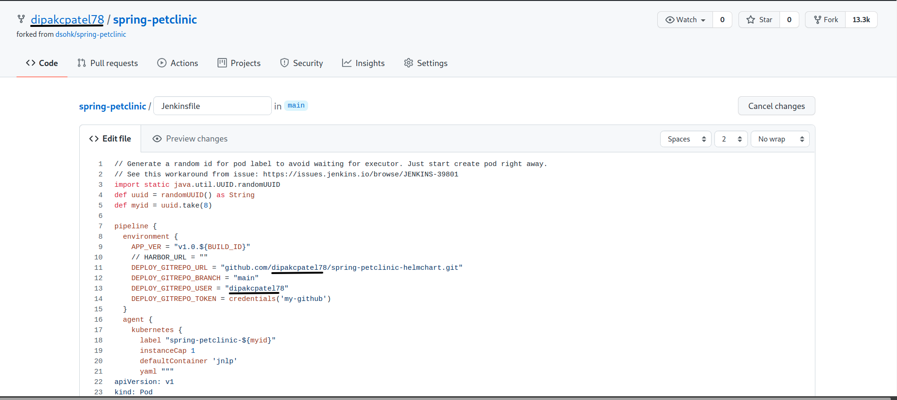
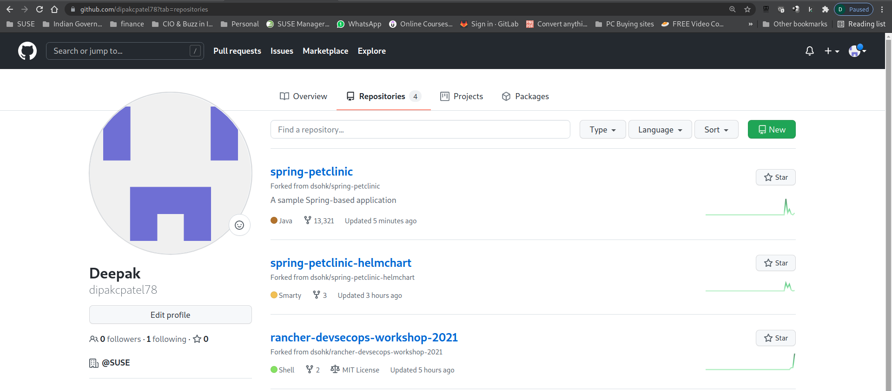

# Part 3 - Configure Jenkins Pipeline to deploy spring-petclinic App

After we have configured and have verified Jenkins is working, let's build the spring-petclinic application. 

Prior to configuring Jenkins, open your Linux workstation terminal where the git repository is located.

Run the command below to show your current lab environment. This shows you all information you need to configure your Jenkins in this section.

```
./show-mylab-env.sh
```

The output should look like below.

```
Your Rancher Server URL: https://18.141.146.73

My Harbor Instance ...
URL: https://18.141.208.163:30443
User: admin
Password: ZD9YfBagvtZ3RjXoAWzpC8gq7NtBQz

Your Jenkins instance is ready ...
http://13.250.30.98:30030/login
Username: admin
Password: 6mXnCWsbJbMsq66HatLYYH

Your Anchore is now successfully provisioned.
URL: http://anchore-anchore-engine-api.anchore.svc.cluster.local:8228/v1/
User: admin
Password: ciANbB7N2F988lyT5fIcFJKJNffVo1JU

Your Sonarqube instance is ready ...
http://13.250.30.98:30667/login
username: admin
initial password: admin


My Github personal access token:

My SonarQube token:

```

A file `mylab_env.txt` should also have created for you. Use text editor to open this file and get ready to record down your further tokens to be collected in this part.

## Setup my Github

### 1. Generate my Personal Access Token

In order to integrate Jenkins with your github account, we have to generate your personal access token for this.

1. Login to your github account
2. Under your avatar icon, pull down the menu and choose `Settings` menu item.
3. Choose `Developer Settings` menu on the left, choose `Personal Access Tokens`
4. Click `Generate new token` button.
5. Enter `workshop` (or whatever you like) in the name field.
6. Choose `repo` and `user:email` in the privieged for this token.




7. Save and record down the generated token in the `mylab_env.txt` file for configuring CI Pipeline in Jenkins later.

### 2. Fork the spring-petclinic project into your own github account

Open a new Browser & past the below link

```
https://github.com/dsohk/spring-petclinic
```

Click on Fork Icon on top right hand window pane & select your own account where the repo will be forked.


In GitHub, navigate to your forked repoistory. Find the code in `Jenkinsfile` and replace `yourname` with your github account name.

Click on the Jenkinsfile to open & `Edit this file` to make changes to you forked repo in Github


Look for section below in Jenkin files & replace `yourname` to `Your Github ID`


Sample Output for reference.


Once the changes are made, scroll down to the bottom of the page & hit `Commit changes` which will commit your change to the `Main` branch of your forked repo. 


### 3. Setup git webhook for spring-petclinic repo to your Jenkins server

1. Click `Settings` in your spring-petclinic github repo.
2. Choose `Webhooks` from the left menu.
3. Click `Add Webhook` button
4. Enter Payload URL: http://<YOUR_JENKINS_IPADDRESS>:<YOUR_JENKINS_PORT>/github-webhook/
5. Choose `Send me everything` for events to trigger this webhook.
6. Click `Add Webhook` button.


### 4. Fork the spring-petclinic-helmchart project into your own github account

Open a new Browser & past the below link

```
https://github.com/dsohk/spring-petclinic-helmchart
```
Click on Fork Icon on top right hand window pane & select your own account where the repo will be forked.

Once the above 2 Repo are forked, those repos are available in your GitHub account. You can check your Repositories to validate. 



## Setup my Sonarqube

1. Login to your Sonarqube instance. Upon successful login, you will be prompt to change your initial password. 
2. Choose `Add a Project`. 


3. Select `Manually` to continue
3. Enter `spring-petclinic` in Project Key and Display Name input field and hit `Set up`
4. In the Provide a token input field, enter `spring-petclinic` and click `Generate Token` button.
5. Record the generate token in your `mylab_env.txt` file for configuring Jenkins later.


## Setup my Jenkins

### Configure Jenkins System

1. Login to Jenkins
2. Navigate to `Managing Jenkins`, then choose `Configure System`.

#### Setup Global Environment variables

Go to `Global Properties` section.

1. Enable `Environment Variables` checkbox
2. Click `Add` button to continue.
3. Add New Environment Variable
   * Key: `HARBOR_URL`
   * Value: (Your Harbor_URL) (just IP:PORT - no http:// or https://)


#### Sonarqube

Enable `Environment variables` checkbox

In the Sonarqube installations click on `Add SonarQube`
section, enter the following.

* Name: `My SonarQube` Note name must spelled excatly as mentioned here.
* Server URL: (Your SonarQube URL)

* Server authentication token: (Click `Add`) to pull down menu and choose `Add Credentials`. If a popup windows does not come up, hit `save` & revist this section again.  

Now clicking `Add` should bring up a windows `Jenkins Credentials Provider: Jenkins` to add credentials.

In the popup window, 
  * Kind: click on dropdown menu to select `Secret text`
  * Secret: (Enter the Sonarqube generated token)
  * ID: `sonarqube-spring-petclinic`

  Click `Add` & Under `Server Authenticiation Token` dropdown menu we should see `sonarqube-spring-petclinic`. Select it. 

Sample Output should show up as below.


#### Git plugin

Specify the github username and email account in this section. It can be any arbitrary account. It will be showing up the commits to your forked helm chart repository later.

1. Global Config user.name : jenkins
2. Global Config user.email: jenkins@example.com

#### Anchore Container Image Scanner

1. Engine URL: (Your Anchore URL)
2. Engine Username: (Your Anchore username)
3. Engine Password: (Your Anchore password)

Click `Save` button to save the Jenkins configuration settings.

### Configure the credentials in Jenkins

1. Navigate to the Jenkins Dashboard.
2. Choose `Manage Jenkins` on the left menu
3. Choose `Manage Credentials` on the security section.
4. Under Stores scoped to `Jenkins`, click the `(global)` dropdown menu. Choose `Add credentials`.
5. In the `Add Credentials` form, choose `Secret text` in `Kind` field.
6. Enter your Github's personal access token in the `Secret` field.
7. Enter `my-github` in the `ID` field. Please MAKE SURE this is correct as to match the value in our Jenkins Pipeline.
8. Click `OK` button to continue
9. Navigate back to the Jenkins Dashboard.

## Setup CI Pipeline for spring-petclinic project

1. Navigate to the Jenkins Dashhoard page
2. Choose `Open BlueOcean` item in the left menu
3. Click `New Pipeline` button
4. Choose `Github` tor respond to Where do you store your code question.
5. Enter your Github personal access token and click `Connect`
6. Choose your github organization.
7. Choose your forked project `spring-petclinic` and click `Create Pipeline` to continue.

Click `Build Now` to run this pipeline. 

We see the build status in Jenkins Blue Ocean plugin and see the Jenkins worker running the container build job


It may take about 20 minutes to finish this pipeline at  the first time. The next run will be faster as all the builds or dependent artifacts are cached in the persistent volume used by the pods for this job.


While we are waiting the first run of this pipeline executing, let's move on to the [Part 4 - Rancher Continuous Delivery](part-4.md). We will come back to revisit the pipeline later. 


