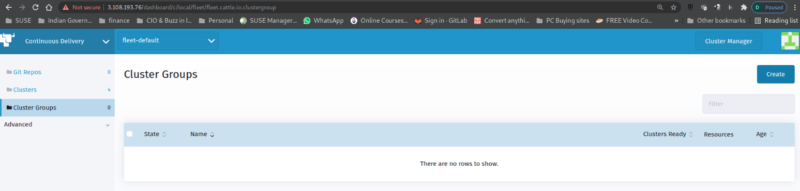
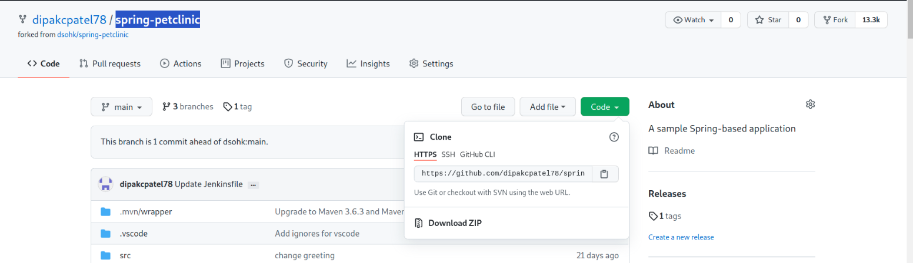
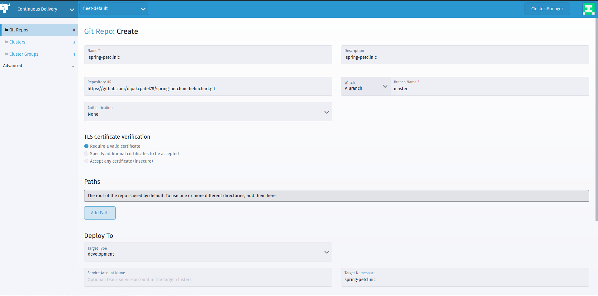
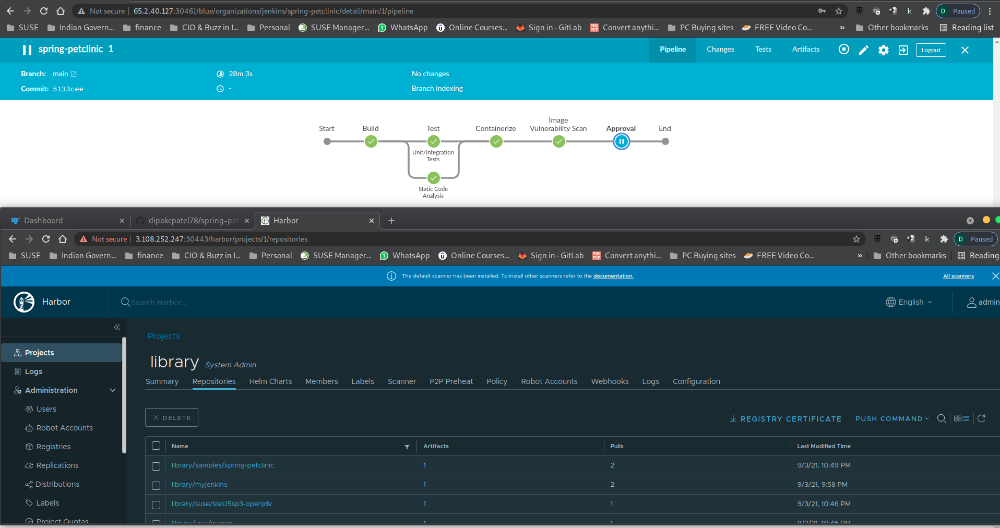
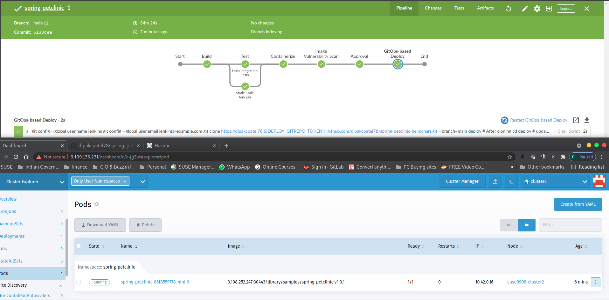

# Part 4 - Rancher Fleet - Continous Delivery 

Watch a video to explain what we are going to do in part 4:

## Rancher Fleet - Continous Delivery

Before we beign the move to configuring Rancher Fleet, please login to Jenkin UI, Harbor UI, Rancher UI, Cluster Explorer view for `Cluster1` and `Cluster2` all open in thier respective browser window.

### Configure Rancher Fleet

To setup Fleet, from Rancher UI, Cluster Manager View  select `Tools` and click on `Continous Delivery`

Under Continous Delivery, you have following options
1) Git Repo
2) Clusters
3) Cluster Groups 
4) Advance

Before we go any further, let verify if we can see all our cluster in Continous Delivery(Rancher Fleet)

With Rancher Fleet you can manage indivisual or group of clusters. Managing cluster via Group reduces adminstrative efforts. 

### Create a Cluster Group
Continous Delivery > Cluster Group > click on `Create`

Provide same Label key value pair which was used to create `Cluster1` and `Cluster2`
Key:Value `(env=dev)` 

Once you key in the key:value pair, Rancher will use the selector labels to indentify the clusters to be associated with our newly created cluster group in Fleet. You will see it show 2/4 cluster been selected. 

Hit `Create` which will create our first Cluster Group.

### Configure Git Repo

Before we ahead for configuring the Git Repo, we need to Git Repository URL.

Follow the instruction below to get to Git Repository URL.

Open you GitHub. You will find your repository on left hand side of the page. If you still not able to find, use the search option and specify the repository name `spring-petclinic-helmchart` 

Click on the Repository URL and you will be taken into the `code` tab. 

In the code page, you will be in the `main` branch. Click on `code` tab, use the drop down menu and you will be presented with the repositroy url. 
Click on the clipboard icon to copy the URL from `HTTPS` tab. 

Sample below for reference. 

In Git Repos, click on `Create` 
Note: Branche Name is `main` and not `master`

Sample output of the GitRepo configuration below

Since the pipeline is in progess while you are configuring Fleet, we expect the below output 

Our Rancher Fleet configuration is completed. 

## 2. View Jenkins Pipeline Progess and Rancher Fleet - Continous Delivery in action.

Just to set the context here, you may see slightly different progress/view, based on which stage of the pipeline.

Below are sample display for your reference only. 

For easy viewing, you can split the screen (Horizontal/Veritcal) as per your preference to observe the progress. 

### Jenkins Container creation stage

### Jenkins approval stage.

At one time in the pipeline, you will get to the `Approval stage`, where you will be prompted to `Approve` or `Decline` the changes. 

Upon approval, jenkins commits the changes to Git Repo. The container image will send to Harbor Registry.

You can toggle to Jenkins UI > BlueOcean and  Harbor UI > Library > Repoistory where you will see our application container image available.

### Fleet in Action

Rancher Fleet is configured for a `Git Repo` and a branch in our case `main` branch to watch for changes/commits. Fleet will picked up the changes and ensure the deploy the bundles in cluster group

Fleet Update is successfully completed.

In Rancher UI, on either `Cluster1` or `Cluster2` you should see our Spring PetClinic Conatiner running. Take a closer look at the version, it should say `spring-petclinic:v1.0.x`.

Now let try to open the Application in a new Browser window
Rancher UI > Cluster Exlporer > Cluster1 > `Services` Tab to expose the Container Application.

Check our applivation version  `spring-petclinic:v1.0.x` as indicated in previous step.

Image below illustrate JenkinUI, Rancher UI & Application in a new browser window.

With this, let's put everything together and proceed to [Part 5](part-5.md)

