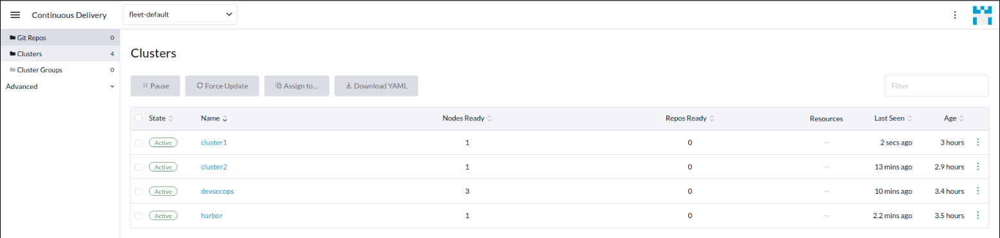
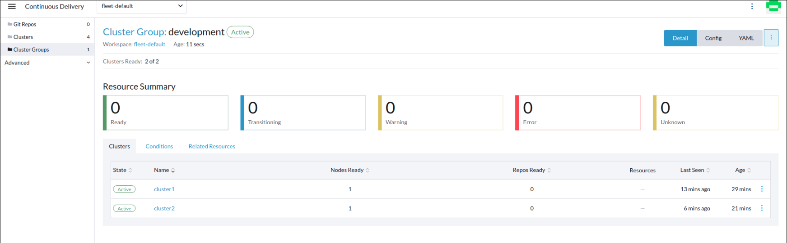
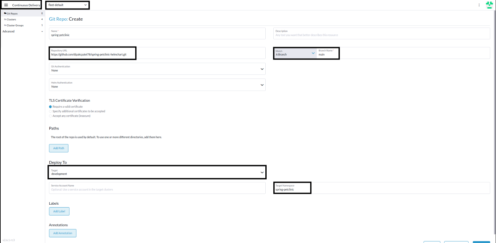
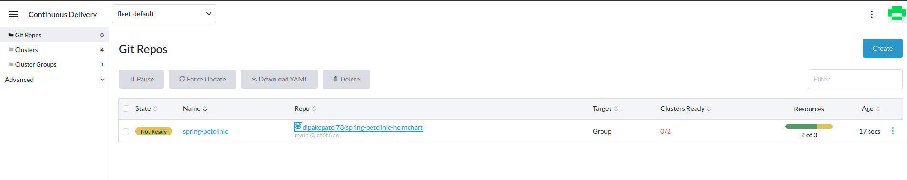
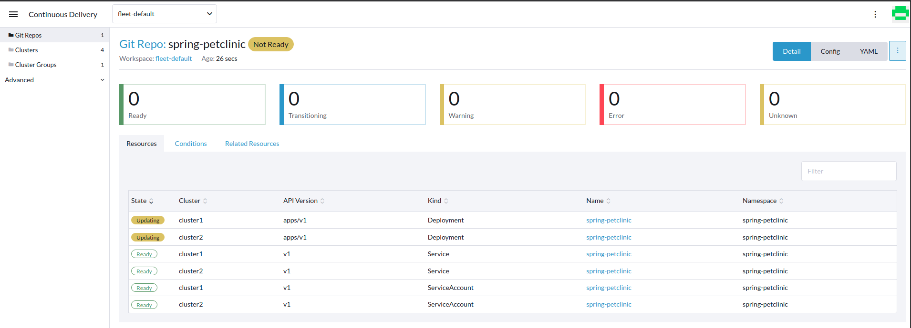
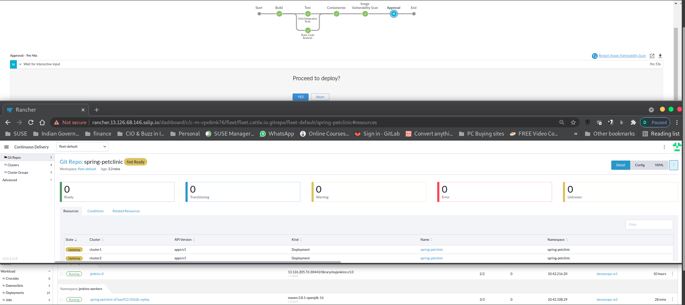
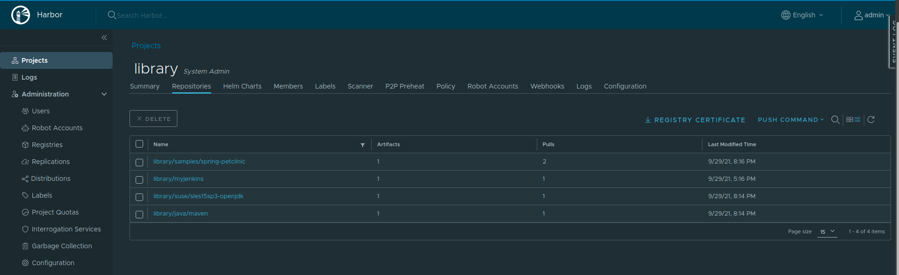
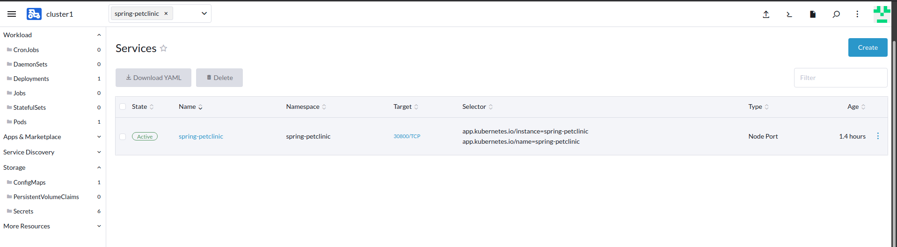
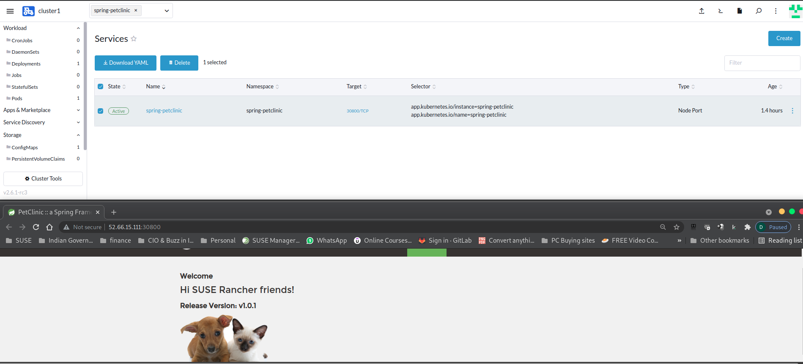

# Part 4 - Integrating Jenkins pipeline with Rancher

Watch the video to understand what you are going to do in part 4:

## Rancher Continous Delivery (CD)

Before you configure Rancher Continous Delivery, please open and login to the following 
a) Jenkin UI
b) Harbor UI
c) Rancher UI
d) Cluster Explorer view for `Cluster1` and `Cluster2`.

### Configure Rancher Continous Delivery (CD)

1) Rancher UI > `Global Apps` > `Continuous Delivery`

Before we proced, let's verify if we can see all our cluster in Continous Delivery

With Rancher Rancher Continous Delivery (CD), one can manage individual or group of clusters. Managing cluster via Group reduces adminstrative efforts. 

### Create a Cluster Group
1) Navigate to `Cluster Group` and click on `Create`. Give it a name `development`

Here we are going to use the same Label which was used to create `Cluster1` and `Cluster2`.

2) Under Cluster Selector provide the following values
Key:`env`
Operator: `in list`
Value:`dev` 
 
Once you key in the key:value pair, Rancher will use the selector labels to indentify the clusters to be associated with our newly created cluster group in Rancher Continuous Delivery. You will see it show 2/4 cluster been selected. 

3) Click on `Create` which will create our first Cluster Group.

### Configure Git Repo

Before we ahead for configuring the Git Repo, we need to Git Repository URL.

Follow the instruction below to get to Git Repository URL.

1) Login into GitHub account
2) Search for the repository named `spring-petclinic-helmchart` 
3) Click on the Repository URL and you will be taken into the `code` tab. In the code tab, you will be in the `main` branch.
4)  Click on `code` tab, use the drop down menu and you will be presented with the repositroy url. 
5) Click on the clipboard icon to copy the URL from `HTTPS` tab. 

Sample below for reference. 

6) In Rancher UI > `Global Apps` > `Continous Delivery` > `Git Repos` click on `Create`
a) Give a name to your Git Rep `Name`
b) Paste the Git Repo URL in `Repository URL`  
c) In the Branche Name type `main` 
d) Use the dropdown option and select the Cluster Group we created previosuly `development`. 
e) Provide a Namespace `spring-petclinic`

Sample output of the GitRepo configuration below

You have successfully completed Rancher Contious Delivery configuration. 

Since the pipeline is still in progress, you can expect below output 

## 2. View Jenkins Pipeline Progess and Rancher Continous Delivery in action.

As your jenkins pipeline is getting built, you can expect different progress/view. 

Below are sample screenshot for your reference only. 

For easy viewing, split the screen (Horizontal or Vertical) as per your preference to observe the jenkins pipeline progress. 

### Jenkins approval stage.

At one stage in the pipeline, you will be prompted to `Appove` the code changes. Options available will be `Yes` or `No`. 

Upon approval, jenkins commits the changes to Git Repo. The container image will be stored in your Harbor Registry.

You can toggle Harbor UI > Library > Repoistory where you will see our application container image available.

### Rancher Continous Delivery in Action

Rancher Continous Delivery is configured for a `Git Repo` and a branch in our case `main` branch to watch for changes/commits. Rancher Continuous CD will pick up the changes and deploy the changes  to the target cluster group

In Rancher UI, on either `Cluster1` or `Cluster2` you should see our Spring PetClinic Container running. Take a closer look at the version, it should say `spring-petclinic:v1.0.x`.

Now let try to open the Application in a new Browser window
Rancher UI > Cluster Exlporer > Cluster1 > `Services` Tab to expose the Container Application.

Check our applivation version  `spring-petclinic:v1.0.x` as indicated in previous step.

Your PetClinic App is been successfully depoyed.

With this, let's put everything together and proceed to [Part 5](part-5.md)

