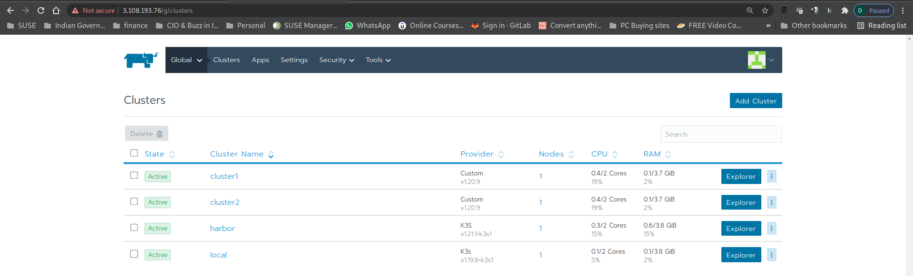

# Part 4 - Rancher Fleet - Continous Delivery 

## 1. Provision all-in-one RKE clusters on VM (cluster1 and cluster2)

Open browser to navigate to the Rancher URL captured in earlier steps. By pass the invalid SSL certificate warning, you should be prompted a `Welcome to Rancher` page. Setup your own administrative password, accept the Terms and Conditions, leave the rest of settings as default to continue.

You will now be navigated to Rancher Cluster Management UI. Click `Add Cluster` button to create new kubernetes cluster with RKE and existing bare-metal servers or virtual machine `Existing Node` option. 


Enter the cluster name as `cluster1`, Under `Labels & Annotation` field, add Label with key value pair `env` and `dev`. Leave the rest of the setting as default and click `Next` button. 


You will be prompted with a command to setup RKE on your VM. Click the `copy` icon to copy the command into your clipboard.


On your linux terminal, execute the below script to access your cluster1 terminal 

Copy the script below to ssh into the cluster1 
```
./ssh-mylab-cluster1.sh
```
Copy & paste the command from Rancher UI on the terminal of VM - Cluster1.


On Rancher UI, you will see cluster 1 coming in few mins. 


Cluster 1 is successfully provision in Rancher

### 2. Provision all-in-one RKE cluster on VM (cluster2)

Repeat all step from step1 for adding cluster 2
Make sure you name the cluster as `Cluster2`



### 3. Connfigure Rancher Fleet - Continous Delivery

Define Cluster Group

Rancher UI > Tools > Continious Delivery


Before we go any further, let verify if we can see all our cluster in Rancher FLeet


Define Cluster Group 
Continuious Delivery - Cluster Groups > Create > Provide necessary details 


Provide unique name  & in cluster selector we need to provide the labels used during cluster creation which will allow Rancher Fleet to associate the cluster to the group. 
We have Labels a key value pair `env` and `dev. We must provide the same Label key value pair in our Cluster group to match cluster labels.

Once we provide label key value pair, Fleet will check existing cluster to match & will show you how many cluster match your request. 

For us Cluster1 & Cluster2 has matching key value paid & Fleet how 2 cluster matching.


Finally we should have our first Rancher Fleet Group created successfully


#### 4. Configure Git Repo

Define git repo 

Git URL: https://github.com/dsohk/spring-petclinic-helmchart 

https://github.com/dipakcpatel78/spring-petclinic-helmchart.git


Target cluster: clustergroup-dev 

Target namespace: spring-petclinic 

Enter the cluster name as `devsecops` and leave the rest of the settings as default and click `Next` button. You will be prompted with a command to setup RKE on your VM. Click the `copy` icon to copy the command into your clipboard.


Comments:
@ Derek, we should be forking your repo to personal github & then leveraging the git repo right ?


