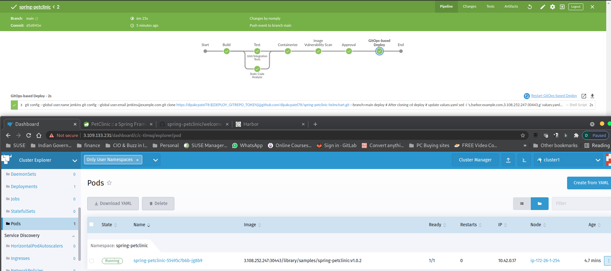
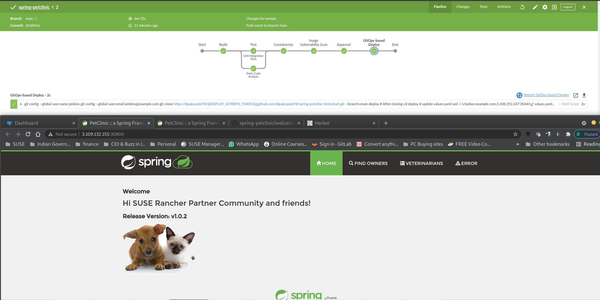

# Part 5 - Put Everything Together

Now, let's modify the source code of the `spring-petclinic` application in Github and commit the changes into `main` branch. We'd expect a new pipeline job will be triggered via Github. 

## 1. Setup your screen layout 

Let's setup your screen layout like below so as to monitor the auto-triggering of Pipeline and Rancher Continuous Delivery.

## 2. Modify source code

1. Navigate to your `spring-petclinic` repo on github with a browser.

2. In the code section, locate this file:

```
src > main > resources > templates > welcome.html
```
Sample Output


3. Modify the file `welcome.html`. Change the greeting text in line 10 from `Hi SUSE Rancher friends!` to anything you like.

Sample Output 


4. Click `Commit Changes` button to continue.

## 3. Observe the new pipeline is running

Observe the new pipeline job is executing to pick up the changes in github and build a new container image for it. After passing all checking, the new build number of this image will be updated in helm chart, which, in turn, will be picked up by Rancher Continuous Delivery to propagate the changes into the target clusters.

Pipeline - Build Job 2 is been build


The new build has completed its static and dynamic code testing & is presently in container creation stage as we see below. 


Anchore has also completed the container image scanning and we finally the approval junction.


Once the approval is provided, the newly container image is then pushed to Harbor


Fleet update in the background is happening. 


Fleet is update successfully with the lastest (second build)



Open Browser & hit the App URL



We have sucessfully build our CI/CD pipeline with SUSE Rancher


