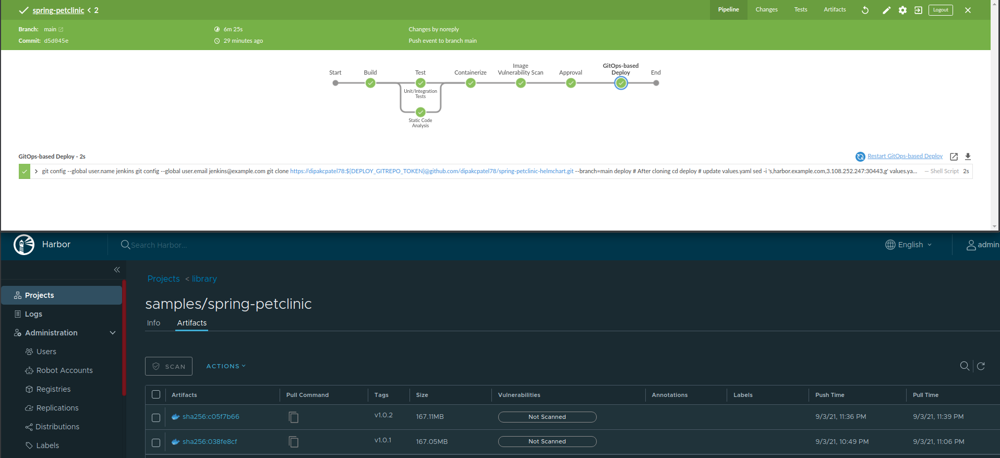
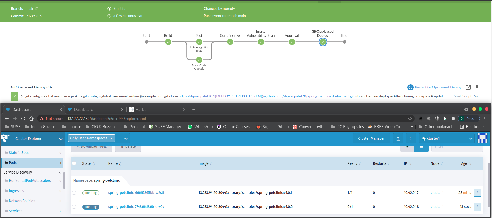
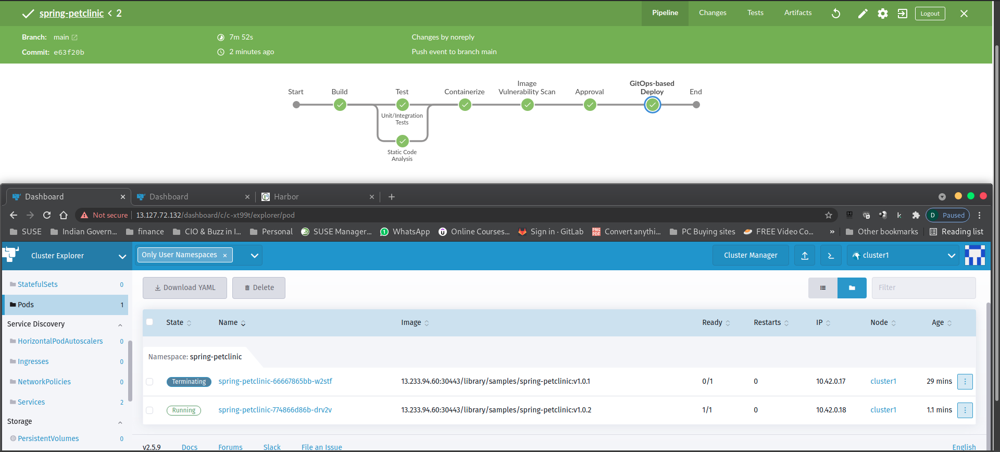
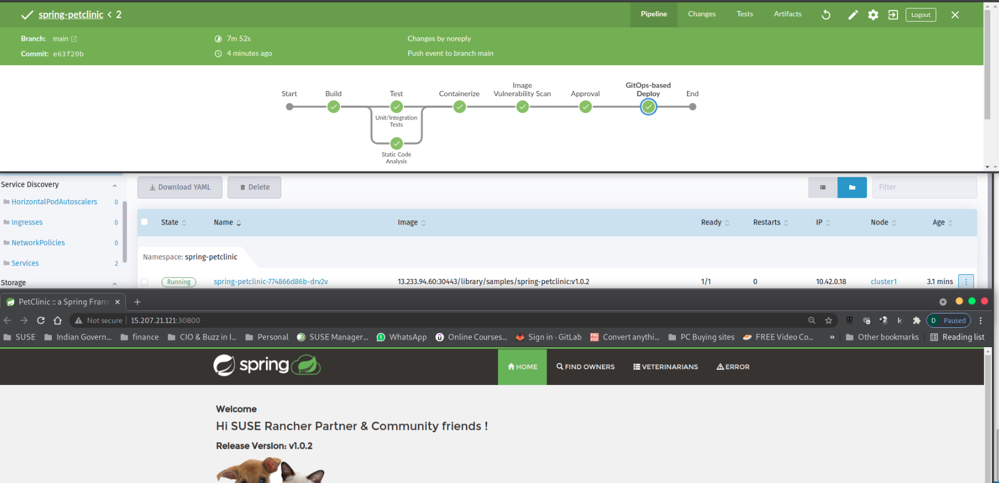

# Part 5 - Put Everything Together

Watch a video to explain what we are going to do in part 5:

[](https://www.youtube.com/watch?v=1vqZvtFKYbI)

## 1. Modify source code

In part 4, you successfully build our containerized application and it's running. 

In this step, you will modify the source code for `spring-petclinic` application. 

1) Login into your GitHub account. Navigate to your `spring-petclinic` repository. 

2) In the code section, locate below file:

```
src > main > resources > templates > welcome.html
```


3) Modify `welcome.html` file content. Line 10 contain greeting text `Hi SUSE Rancher friends!`. You can change the greeting message to your desired one.

4) Click `Commit Changes` button to save your changes. 

## 3. Observe the new pipeline being built

1) In the above step, you have modified your source code. This will trigger a new pipeline job in Jenkins.


2) Below screenshot indicates it's in container creation stage.


part5-pet-clinic-pipeline-build-ver2-job-approval-pg2


3) Anchore has completed container image scanning phase and post that we get to the Approval junction.


4) Once the changes are accepted by clicking on `Yes` GitHub would be updated with new container image version and then the new image will be pushed to Harbor. You can login into Harbor to verify the same. You should see v1.0.2 as the lastest container image for the application.



5) Rancher Continuous Delivery process will be trigged with version update in GitHub.


6) You will see Build1 (v1.0.1) containaer is up and running (1/1), however build2 container (v1.0.2) is been coming up (0/1)



7) In a few seconds, we will see the build2-v1-0-2 container up and running & build1-v1-0-1 getting terminated. 



8) Check Git Repo status in Rancher UI and the status would be in `active` state, 


9) In Rancher UI > Services Page


10) To open the applicatin, click on `NodePort` to and the application will open in a new browser window.

We expect to see application version `1.0.2` and updated welcome message `Hi SUSE Rancher Parnter & Community friends!` and sure we do see...



You have successfully made changes to our code in GitHub, Git remain single source of truth. 

Jenkins picks up the changes automatically and build new job for your changes. Upon your approve the updated changes are then picked up by Rancher Continuous delivery and the application get deployed on your cluster. Once the new application is up and running, the older version gets terminated. 

Congratulation! you have sucessfully build our CI/CD pipeline with SUSE Rancher for continuous development and delviery. We hope you have enjoyed exploring a little of what Rancher can do to your kubenetes development, deplyment, and management.

**When you have finished playing with your lab environment go to Part 6 - Cleaning up the lab environment**


